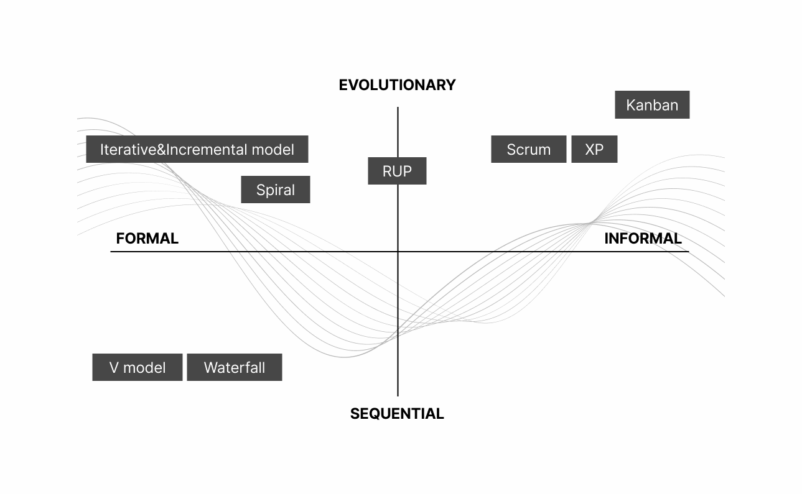

# Introduction

The scope of this document is to create and document guidelines, norms, and procedures for the _software engineering_ aspects of development, evolution, and long-term operation of the NSDF software stack, in particular regarding::

-   Use of repositories, branching, and versioning methodologies
-   Use of programming languages and frameworks
-   System and code documentation, and their continued sustainment
-   Style guidelines for user interfaces, code construction
-   Code review procedures
-   Deployment staging procedures
-   Test requirements: Unit, Regression, Integration, and Top-level validation approaches
-   Development project methodologies (e.g. agile practices)
-   Continuous integration and deployment (CI/CD) practices
-   Package management practices
-   Container management practices
-   Change management recommendations

Authors in alphabetical order:

| Name              | Email |
| ----------------- | ---------------------------------------------------------------- |
| Daniel Balouek    | [daniel.balouek@utah.edu](mailto:daniel.balouek@utah.edu) |
| Kevin Coakley     | [kcoakley@ucsd.edu](mailto:kcoakley@ucsd.edu)             |
| Jakob Luettgau    | [jluettga@utk.edu](mailto:jluettga@utk.edu)               |
| Paula Olaya       | [polaya@vols.utk.edu](mailto:polaya@vols.utk.edu)         |
| Giorgio Scorzelli | [scrgiorgio@gmail.com](mailto:scrgiorgio@gmail.com)       |
| Glenn Tarcea      | [gtarcea@umich.edu](mailto:gtarcea@umich.edu)             |
| Naweiluo Zhou     | [naweiluo.zhou@utk.edu](mailto:naweiluo.zhou@utk.edu)     |

This is a guide to software development at the NSDF. It both serves as a source of information for exactly how NSDF works, and as a basis for discussions and reaching consensus about how to_ develop software_.

A *Software Development Life Cycle* (SDLC) is a methodology followed to create _high-quality software_. By adhering to a standard set of tools, processes, and duties, a software development team can build, design, and develop products that meet or exceed their clients' expectations.

Source: https://brocoders.com/blog/agile-software-development-life-cycle

The most famous SDLC models are:

-   [Waterfall](https://en.wikipedia.org/wiki/Waterfall_model): Follows a sequential model of phases, each of which has its tasks and objectives
-   [Cleanroom](https://en.wikipedia.org/wiki/Cleanroom_software_engineering): A process model that removes defects before they cause serious issues
-   [Incremental](https://en.wikipedia.org/wiki/Incremental_build_model): Requirements are divided into multiple standalone modules
-   [V-Model](https://en.wikipedia.org/wiki/V-Model): Processes are executed sequentially in a V-shape i.e. each step comes with its testing phase
-   [Prototype](https://en.wikipedia.org/wiki/Prototype-based_programming): A working replication of the product is used to evaluate developer proposals
-   [Big Bang](https://www.tutorialscampus.com/sdlc/big-bang-model.htm): Requires very little planning and has no formal procedures; however, it's a high-risk model
-   [Agile](https://en.wikipedia.org/wiki/Agile_software_development): Uses cyclical, iterative progression to produce working software

This document specifies the software development procedures for the NSDF project and includes all development procedures between high-level requirements and either software release or the initiation of a DevOps deployment process.

## Software checklist

In this section, we provide a short checklist for software projects, and the rest of this document elaborates on the various points in this list.

The bare minimum that every NSDF software project should do is:

- choose and include an open-source license

- use version control to enable collaborative developing

- use a publicly accessible version-controlled repository

- add a README.md file describing the project. This file is targeted towards developers. Keeping basic documentation in README.md can be useful for other developers to track steps and design decisions. Therefore it is convenient to create it from the beginning of the project when initializing a git repository.

  

NSDF also recommends doing the following, from the start of the project:

- use **code quality tools**

- use **testing**

- use **standards** (protocols, conventions, tools, etc.)

- Release user and development documentation

- Provide **issue trackers**

- Make the software citable adding a **DOI**

- Release the software to a public registry

- Add a public channel for communication

-   Implement and add a **code of conduct**
    -   A code of conduct defines standards for how to engage in a community.
    -   It signals an inclusive environment that respects all contributions.
    -   It also outlines procedures for addressing problems between members of your project's community.
    -   See [https://docs.github.com/en/communities/setting-up-your-project-for-healthy-contributions/adding-a-code-of-conduct-to-your-project](https://docs.github.com/en/communities/setting-up-your-project-for-healthy-contributions/adding-a-code-of-conduct-to-your-project)
    
- Add a contribution guideline document.

  

## Programming languages and conventions

From the beginning of the project, a decision on the code style has to be made and then should be documented. 

Not having a documented code style will highly increase the chance of inconsistent style across the codebase, even when only one developer writes code. 

The NSDF should have a sane suggestion of coding style for each programming language we use. Coding styles are about consistency and making a choice, and not so much about the superiority of one style over the other

If your programming language supports namespaces, use `nsdf.*` to clarify the origin of the software.

NSDF wants to limit the development to a few core languages and frameworks. 

**At the NSDF we prefer C++, Python, Go, and JavaScript.**

### C/C++

C/C++ is the NSDF programming language for fast and core services such as the visualization and low-level storage of multi-resolution data.

NSDF C/C++ environment is built on:

-   C++ version: C++11 or C++17
-   Visual Studio for Windows, gcc/clang on other platforms
-   Code style: [CppCoreGuidelines](https://github.com/isocpp/CppCoreGuidelines/blob/master/CppCoreGuidelines.md)
-   Minimal self-contained dependencies (e.g. STL, boost, etc.)
-   Cross-platform make tool: CMake

Libraries:

-   [Open MPI](https://www.open-mpi.org/) . to enable parallelism
-   [Boost C++ ](https://www.boost.org/)is a popular collection of peer-reviewed, free, open-source C++ libraries.
    -   Code is generally very high-quality, is widely portable, and fills many important gaps in the C++ standard library, such as type traits and better binders.
    -   Maybe can hamper readability excessively "functional" style of programming
-   [JSON for Modern C++](https://nlohmann.github.io/json/)
-   [hdf5-cpp](https://bitbucket.hdfgroup.org/projects/HDFFV/repos/hdf5/browse) : The popular HDF5 binary format C++ interface.
-   [ZeroMQ](https://zeromq.org/): lower level flexible communication library with a unified interface for message passing between threads and processes, but also between separate machines via TCP.

### Python

Python is the NSDF *dynamic language of choice*.

We use it for data analysis and data science projects using the SciPy stack and Jupyter notebooks, and for many other types of projects: workflow management, visualization, web-based tools, etc.. It is not the language of maximum performance, although in many cases performance-critical components can be easily replaced by modules written in faster, compiled languages like C/C++ or CPython.

Python is very flexible and the most used programming language for scientific applications: a large number of useful frameworks and libraries are written in Python. Python allows easy integration with low-level bindings (e.g., C/C++) if efficiency is critical.

NSDF Python environment is built on:

-   Python 3.7+
-   Web applications: [Django](https://www.djangoproject.com/), [Flask](https://flask.palletsprojects.com/en/2.0.x/)
-   Packaging: PiPy, Manager: pip (would avoid conda when possible)
-   Other services: [Tornado](https://www.tornadoweb.org/)
-   Templating: [Jinja](https://jinja.palletsprojects.com/)
-   Code style:[PEP 8](https://www.python.org/dev/peps/pep-0008/)

Notebooks:

- Client-side: [Jupyter Notebook](https://jupyter.org/)

- Server-side: [JupyterLab](https://jupyterlab.readthedocs.io/en/stable/)

  

IDE:

- JetBrains [PyCharm](https://www.jetbrains.com/pycharm/)

  

Core scientific packages:

- [NumPy](https://numpy.org/)

- [https://scipy.org/](https://scipy.org/)

- [Pandas](https://pandas.pydata.org/)

- [Scikit-learn](https://scikit-learn.org/stable/)

- [Dask](https://dask.org/)

  

Visualization packages

- [Matplotlib](https://matplotlib.org/). the standard in scientific visualization. It supports plotting through the `pyplot` submodule. It is highly customizable and runs natively on many platforms, making it compatible with all major OSes and environments. It supports most sources of data, including native Python objects, NumPy, and Pandas.

- [Seaborn](http://seaborn.pydata.org/index.html) is a Python visualization library based on Matplotlib and aimed towards statistical analysis. It supports NumPy, pandas, scipy, and statmodels.

- [bokeh](https://github.com/bokeh/bokeh) is Interactive Web Plotting for Python.

- [Plotly](https://plotly.com/) is a platform for interactive plotting through a web browser, including in Jupyter notebooks.

  

Parallelization packages:

- The [multiprocessing ](https://docs.python.org/3/library/multiprocessing.html)module is the standard way to do parallel executions in one or multiple machines, it circumvents the GIL by creating multiple Python processes.

- in Python 3 is the[ concurrent.futures](https://docs.python.org/3/library/concurrent.futures.html)  module

- See [Using IPython for parallel computing](https://ipython.org/ipython-doc/3/parallel/)

  

### Go

Go is a statically typed, compiled programming language that is open-sourced and maintained by Google. Go uses a garbage collector to handle memory leaks.

Go is very fast and mostly used for server-side applications.

NSDF Go environment is built on:

- Go 1.17+ (Recommend upgrading to the latest version whenever it becomes available. Versions are backward compatible. Version 1.18 will release “generics” for Go)

- Code style: The Go community has standardized around the “go fmt” tool. All code should be run through the “go fmt“ tool to properly format it.

- Dependencies Management: Use Go Modules for dependencies management.

- Builds: Even though Go has a toolchain for builds it is recommended that a Makefile be created to hide the options.

- Background “Daemon” processes: This is an area it is too easy to get wrong. Instead, use supervisord to handle background processes.

- Web services: There are many different web service frameworks available. I’ve standardized on using Echo (echo.labstack.com). It has less boilerplate than the standard library and decent documentation.

- Databases: Go has a standard DB library. I recommend using either the “sqlx“ package or gorm. I expect once Go 1.18 is released that many of the packages that currently rely on reflection will see a lot of changes.

  

### JavaScript

JavaScript is the programming language for the World Wide Web, alongside HTML and CSS. All web browsers have a dedicated JavaScript engine to execute the code on users' devices.

On the server side, there is `Node.js`, an open-source cross-platform JavaScript runtime environment with an event-driven architecture capable of asynchronous I/O.

NSDF JavaScript environment is built on:

-   ECMAScript 6
-   Packaging: [NPM](https://www.npmjs.com/), Resolver: Yarn (faster)/npm
-   Cross-compiler: [Babel](https://babeljs.io/)
-   Code style:[ Airbnb](https://github.com/airbnb/javascript)
-   MVC/SPA Clientside frameworks:  [React](https://reactjs.org/), [Angular](https://angular.io/), [Vue](https://vuejs.org/)
-   Angular is an application framework by Google written in TypeScript.
-   React is a library that can be used to create interactive User Interfaces by combining components. It is developed by Facebook.
-   Vue.js is an open-source JavaScript framework for building user interfaces.

Security Considerations:

- XSS

  

### Awesome List

On GitHub, there is a concept of an *_awesome list*, that collects awesome libraries and tools on some topic. For instance, here is a subset:

- Python: [https://github.com/vinta/awesome-python](https://github.com/vinta/awesome-python)

- C++ [https://github.com/fffaraz/awesome-cpp](https://github.com/fffaraz/awesome-cpp)

- Go [https://github.com/avelino/awesome-go](https://github.com/avelino/awesome-go)

  

## Links/Bibliography

List:

-   [README.md template · GitHub](https://gist.github.com/jxson/1784669)
-   [The art of ReadMe](https://github.com/hackergrrl/art-of-readme/blob/master/README.md)

    ​      
