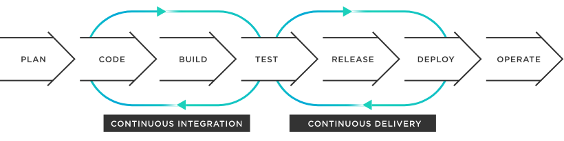
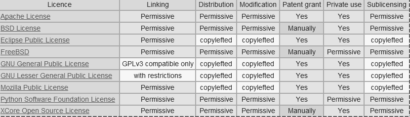
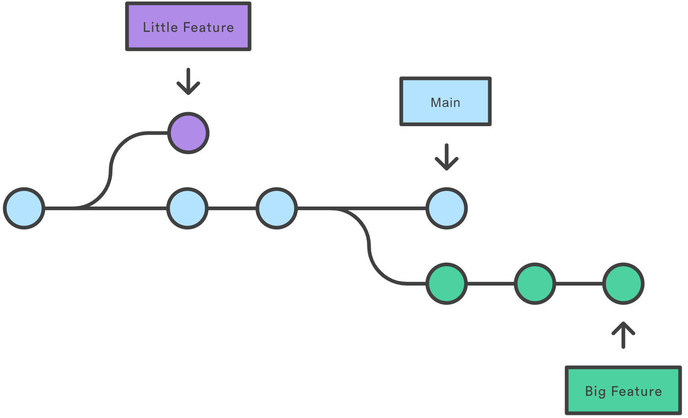
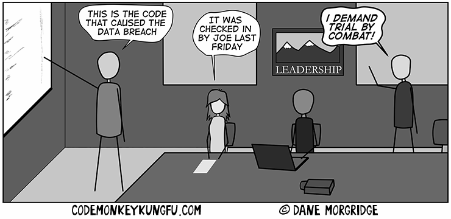

# Continuous Integration

Overview of section contents:

| Section             | Description                                                  |
| ------------------- | ------------------------------------------------------------ |
| Version control     | standards to use Git to enable code version control for public and private repository |
| Git branches        | different Git branches of the same project to enable multiple developments in parallel |
| Git workflows       | NSDF recommends GitHub Flow for the complex repositories and Git Flow for all other cases. |
| Semantic Versioning | Industry standards to name software versions                 |
| Code reviews        | standardization of code review to improve software quality   |

---

In 1994, the term “_Continuous Integration_” (CI) was introduced by American software engineer Grady Booch, who is best known for developing the *Unified Modeling Language* (UML) but also for his innovative work in software architecture and collaborative developer environments.

Continuous integration has been regularly employed since 1997 and is now widely accepted as the best practice for software development. Although the process of continuous integration may look a bit different today than it did 20 years ago, the theory behind it nonetheless remains the same.

_Continuous integration_ is the practice of continuously integrating code changes from different developers working on the same code into a single software project. This integration is an ongoing and continuous process to ensure that all changes are properly recorded. This strategy is an essential part of an _Agile Software Development System_, which is built around the concept of collaboration, designing for scale, and building sustainability.



<p align='center'>Continuous pipeline</p>

_Continuous Integration_ / *Continuous Delivery* (described in the following section) is an _eight-step_, agile process that ensures fast, effective, and stable software development.

- _**Plan**_: Changes to the application are planned by the product team. This could include bug fixes, performance enhancements, or new features to be added to the application.

- _**Code**_: The developers code the software on their local machines. Each developer has a specific part of the system to develop or a bug to resolve.

- _**Build**_: the new code is submitted to the code repository and the application is compiled.

- **_Test_**: tests check the functionality and usability of the code. Automated testing is used to ensure that the new code doesn’t interfere with other parts of the package.

- _**Release**_: the code is merged and can be set to an automated release, pending approval.

- _**Deploy**_: The code is automatically deployed to production.

- **_Operate_**: the new code can be operated within the production environment.

- _**Monitor**_: Application performance is continually monitored to find bugs and identify performance problems.

  

Continuous integration will help NSDF to ensure:

- _Time savings:_ it removes any double-up on tasks, automating testing and merging processes

- A _more robust product:_ regular testing implies fewer bugs and fixes.

- _Increased communication_: code sharing increases the speed and efficiency of communication

- _Faster software releases_: changes can be fixed, tested and rolled out in tight timeframes.

- _Limit integration conflicts_**:** regular updates minimize potential conflicts; problems can be quickly identified

- _Modular code: \_facilitate the development of_ \_less complex code

  

## Version control


Version Control enables developers to keep track of the revisions in software development projects and allows them to work together on those projects.

Version control makes it easier to work on the same code simultaneously, while everyone still has a well-defined version of the software. 

Also, Version Control makes it easier to integrate with other software that supports _modern software development_, such as testing (continuous integration, automatically run tests, build documentation, check code style, integration with bug-tracker, code review infrastructure, comment on code, etc.).

NSDF repositories should preferably be public from the start; but **we tolerate private repositories,** to be switched to a public status when they reach a certain level of _curation_.

To prevent _private repositories_ from remaining unnecessarily private forever please add a brief statement in the README of your repository, clarifying:

- Why is this repository private?

- On which date can this repository be made public?

- Who should be consulted if we would like to make the repository public in the future?

  

The official NSDF repository is [https://github.com/nsdf-fabric](https://github.com/nsdf-fabric)

NSDF recommends the use of Git (versus CVS, Apache Subversion, Mercurial, etc.)  since it has a lot of improvements over its competitors, and it’s perfect for NSDF distributed projects. Github provides a way to communicate in a more structured way, such as in code reviews, commits, and issues.

One downside of Git is that it can be sometimes difficult to explain to a non-expert, and there is likely to be a slow down in production as programmers adapt to it. But, once it is learned, the whole software cycle speed will increase.

To give proper `push` /`pull` permissions on NSDF repositories (ref. [https://github.com/nsdf-fabric](https://github.com/nsdf-fabric)), we recommend adding a new `SSH key` for each user, to avoid typing passwords repeatedly. The procedure is just a few-minutes time consuming (ref  [Adding a new SSH key to your GitHub account](https://docs.github.com/en/authentication/connecting-to-github-with-ssh/adding-a-new-ssh-key-to-your-github-account)) and it consists of:

- Generate a new SSH key (or recycle an existing one)

- enter the “GitHub settings“ section and select “SSH and GPG keys”

- paste the SSH

  

In creating a new NSDF repository some suggestions are:

-   include a `.gitignore` file
-   Add a `README.md` file explaining what the project does, why it is useful, how users can get started, how users can help, and who maintains/contributes to the project
-   Add a `LICENSE` file. It tells others if and how they can use, change, or distribute your software. It protects both sides from legal troubles. The license should be included in a `LICENSE` file at the root of the project directory as per standard practice. 
    -   See [https://choosealicense.com/](https://choosealicense.com/) for deciding what license.

-   be careful to _commit messages:_ they are the way for other developers to understand changes in the codebase. It is very important to explain the why behind implementation choices.



<p align='center'>Comparison of licenses</p>

Each source file of any NSDF software should start with the following copyright statement at the top :

```
Copyright NSDF and Licensed under the XXX License, version YYYY.
See LICENSE for details.
```


The same notice should be somewhere in your `README` file, which should also contain an overview of dependencies and which licenses they are under.

**We also suggest the creation of DOIs for all NSDF software.** Software citation is important as scientific research becomes more open and more digital. Advantages to making software citable include:

-   Gives credit to the software developers
-   Supports scientific transparency
-   Improves reproducibility of research that relies on the software
-   Helps the community by enabling reuse of your code and methods
-   Supports FAIR software principles


NSDF software should contain sufficient information for others to be able to cite its software, such as authors, title, version, and DOI.

GitHub has default integration with Zenodo by CERN.  Any time a new release is made, the repository will be automatically archived and issued a new DOI by Zenodo. From this [article](https://zenodo.org/record/45042/files/MakingCodeCitableWithZenodoAndGitHub_SoftwareSustainabilityInstitute.pdf?download=1):

> For Open Science, it is important to cite the software you use in your research. Particularly, you should cite any software that made a significant or unique impact on your work. Modern research relies heavily on computerized data analysis, and we should elevate its standing to a core research activity with data and software as prime research artifacts.  Steps must be taken to preserve and cite software in a sustainable, identifiable, and simple way. This is how digital repositories like Zenodo can help.
>
> 

## Git branches


In Git, branches are a part of your everyday development process. 

Git branches are effectively a pointer to a snapshot of changes. When there is a new feature or bug fixing, the developer creates a new branch to _encapsulate_ the changes. 

This simple process makes it harder for unstable code to get merged into the main code base and encourages the cleaning up before merging into the main branch.



<p align='center'>Example of Git branching</p>


As an example, in the above figure, two isolated lines of development are shown:

-   one purple line: the new branch is created for developing a “little” feature
-   one green line: the new branch is created for a longer-running “big” feature
-   meanwhile, the main branch is unaffected

By developing the new features in branches, the work can proceed in parallel, keeping also the main branch isolated from _still-in-development_ (and possibly buggy) code.


## Git workflows


When working on a Git-managed project, we need to make sure the team agrees on what workflow to adopt i.e. how the flow of changes will be applied.  

A Git Workflow is a recipe or recommendation for how to use Git to accomplish work consistently and productively.  Given Git's focus on flexibility, there is no standardized way to interact with Git.

For a full discussion on workflows, advantages and cons, please read “_Appendix I. Git Workflows_”.

**NSDF recommends GitHub Flow for its more complex repositories and Git Flow for all other cases.**


## Semantic Versioning


Semantic Versioning is the most accepted and used way to add numbers to software versions. It is a way of communicating the impact of changes in the software on users.

Semantic versioning is an industry-standard for software versioning. The overall idea is that given a version number “major.minor.patch“, we will increment the:

-   `MAJOR` version when there are breaking/incompatible API changes
-   `MINOR` version when there is added functionality/features in a backward-compatible manner
-   `PATCH` version when there are backward-compatible bug fixes


Major version zero `0.y.z` is for initial development. Anything may change at any time. The public API should not be considered stable.

Version 1.0.0 defines the first public API.

Prerelease information may be appended, separated by a dash. 

The prereleases can be versioned too ( eg. 1.2.3-beta.1, 1.2.3-beta.2, etc). Typical prerelease stages include:

-   _alpha_: internal testing, may not be feature-complete
-   _beta_: external testing, should be feature complete
-   *release candidate* (RC): this code will be shipped unless bugs are found


## Code reviews


At the NSDF, we value software quality. 

Higher quality software has fewer defects, better security, and better performance, which leads to users who can work more effectively.

Code reviews are an effective method for improving software quality. Code reviews are used to ensure consistency and quality across a project.  They are a key aspect of the success of any development team.

Code review also improves the development process. By reviewing new additions for quality, less technical debt is accumulated, which helps the _long-term maintainability_ of the code. Reviewing lets developers learn from each other and spreads the knowledge of the code around the team. It is also a good means of getting new developers up to speed.

Code reviews are effective because they put a double control on the code, and force authors to explain their purposes in clear language. It will be less probable to commit overly-complicated code: if the reviewer is not able to understand it, he will refuse the \_pull request \_asking for clarifications.

This is also the reason why code reviews are also an incredible ource of frustration \and delays. 

In this [2021 DevOps Survey](https://about.gitlab.com/developer-survey/) code quality was one of the top reasons to choose DevOps, but, at the same time, code reviews were one of the top four pain points (with testing, planning, and code development.  

The main purpose of a code review is to find issues or defects in a piece of code. These issues then need to be communicated back to the developer who proposed the change, so that they can be fixed. The goal of a code review is not to provide criticism of a piece of code, or even worse, the person who wrote it. The goal is to help create an improved version.

**NSDF recommends that every change must be reviewed**, and every change must be approved.  

The NSDF reviewers should look at (copying from [Google Code Review Developer Guide](https://docs.google.com/document/d/1hEtI6l4JkDwqBff2XBIb8pbr4Iv2PV8X/edit?rtpof=true)):

| What          | Description                                                  |
| ------------- | ------------------------------------------------------------ |
| Design        | The overall design of the code should make sense within the code base and integrate well with the system |
| Functionality | The code must meet the needs of the _user story_ and should consider edge cases too. |
| Complexity    | The code must not be too complex. Pieces of evidence of overcomplexities are: “_code can’t be understood quickly”_ or “_developers are likely to introduce bugs when trying to modify the code_”. Also, the code must not be over-engineered i.e. it is trying to solve preemptively non-existent problems. |
| Naming        | Code must use clear names for variables, classes, methods.   |
| Tests         | Code must include unit tests and other types of tests as appropriate. Tests must be correct, concise, useful, sensible, and cover an _acceptable amount_ of the code. |
| Comments      | The code must be commended adequately and comments must not be _verbose._ |
| Style         | The code must follow project style guidelines i.e. it must be consistent with the surrounding code. |
| Documentation | In case of significant changes, the documentation must be updated as well. |


Major problems regarding code reviews are:

-   Code reviews are _impersonal_: they are almost always conducted via \_online text \_communications. This can result in communications challenges: developers could be \_protective \_of their work, and some comments can be perceived as offensive
-   code reviews can become sometimes too a _nitpicking process_, causing frustration
-   code reviews could take too long resulting in a general slowdown of the development
-   Code reviews are highly subjective, based on the assigned reviewers.
-   



<p align='center'>Source Dane Morgridge codemonkeykungfu.com</p>

To solve these problems NSDF recommends some best practices:

- convert problematic code reviews to be on-person or on conference-call

- 24/48 hours is the maximum time a code review should take. And the author’s response to observations should be fast as well

- as accept an \_almost-perfect \_code review and ask the author to do the minor fixes subsequently.

- don’t send large code reviews

- do not mix changes belonging to different problems.

- In case of emergencies (like a demo, deadlines, etc) some rules can be \_relaxed. \_Keep track of this relaxation by creating an ad-hoc branch

- use courtesy when reviewing code and providing guidance. This is a process built on mutual respect, and is not intended to shame people or negatively express dissatisfaction  (citing Microsoft guidelines “_Don’t criticize the submitter, point out flaws in the code_”).

- integrate code reviews in the CI pipeline (e.g. “_Git pull requests_”) to keep the history

  

## Links/Bibliography


List:

-   [https://www.tibco.com/reference-center/what-is-continuous-integration](https://www.tibco.com/reference-center/what-is-continuous-integration)
-   [Git Branch | Atlassian Git Tutorial](https://www.atlassian.com/git/tutorials/using-branches) 
-   [Comparing workflows - Atlassian Git Tutorial](https://www.atlassian.com/git/tutorials/comparing-workflows) 
-   [The Best Branching Strategies For High-Velocity Development](https://www.perforce.com/blog/vcs/best-branching-strategies-high-velocity-development) 
-   [Gitflow workflow vs Feature Branch workflow](https://medium.com/medvine/gitflow-workflow-vs-feature-branch-workflow-8fb4c26571c5) 
-   [Using Gitflow with the GitHub Fork & Pull Model](https://www.dalescott.net/using-gitflow-with-githubs-fork-pull-model/)
-   [What are GitLab Flow best practices?](https://about.gitlab.com/topics/version-control/what-are-gitlab-flow-best-practices/) 
-   [Semantic Versioning](https://semver.org/) 2.0.0 
-   [Google Code Review Developer Guide](https://docs.google.com/document/d/1hEtI6l4JkDwqBff2XBIb8pbr4Iv2PV8X?rtpof=true&authuser=scrgiorgio%40gmail.com&usp=drive_fs)
-   [How We Do Code Review (Microsoft)](https://devblogs.microsoft.com/appcenter/how-the-visual-studio-mobile-center-team-does-code-review/)
-   [I’ve code reviewed over 750 pull requests at Amazon](https://curtiseinsmann.medium.com/ive-code-reviewed-over-750-pull-requests-at-amazon-here-s-my-exact-thought-process-cec7c942a3a4)
-   [Google Code Review Developer Guide](https://sci-visus.slite.com/app/channels/uKa9w4MB0C/notes/ZMBNTA3qc)
-   [Code Review Best Practices. ](https://levelup.gitconnected.com/code-review-best-practices-cf6f4bfeeb3e)
-   [Designing a rubric for feedback on code quality in programming courses | Proceedings of the 16th Koli Calling International Conference on Computing Education Research](https://dl.acm.org/doi/10.1145/2999541.2999555)
-   [Why code review beats testing: evidence from decades of programming research | Kevin Burke](https://kevin.burke.dev/kevin/the-best-ways-to-find-bugs-in-your-code/)
-   [Best Practices for Code Review | SmartBear](https://smartbear.com/learn/code-review/best-practices-for-peer-code-review/)
-   [Code Reviews: Just Do It](https://blog.codinghorror.com/code-reviews-just-do-it/)
