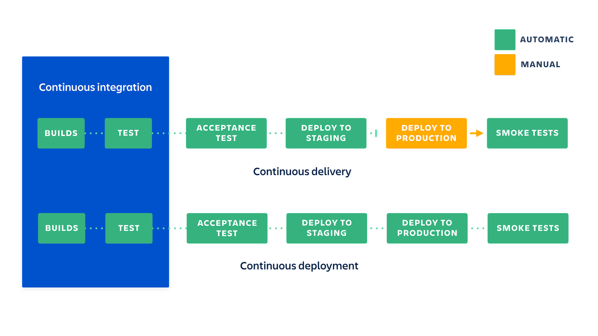
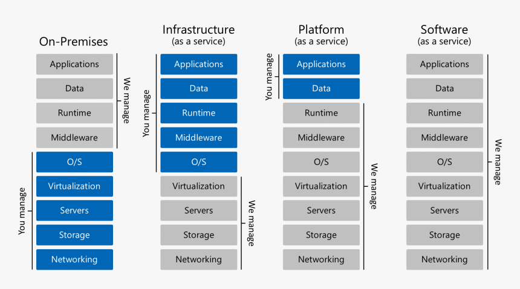
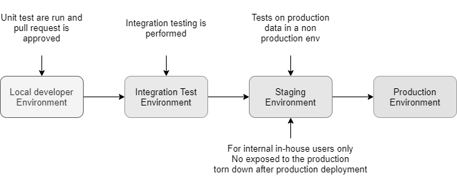
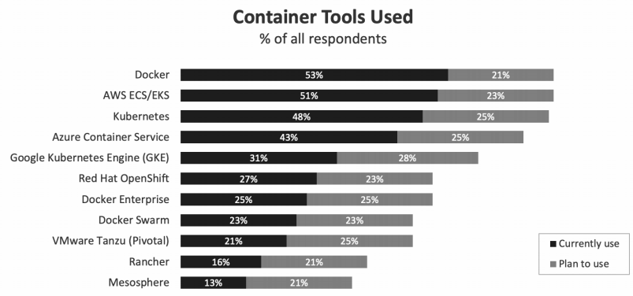
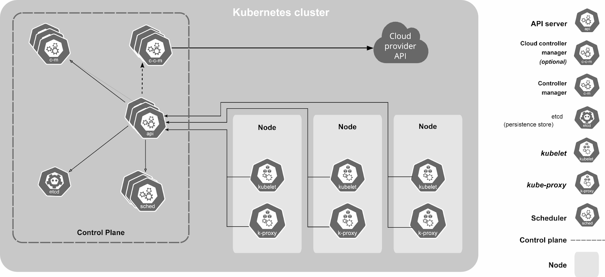
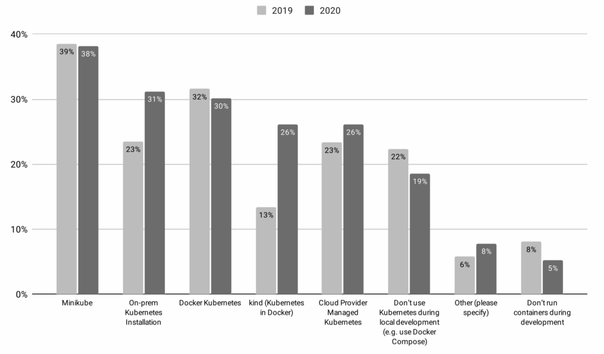
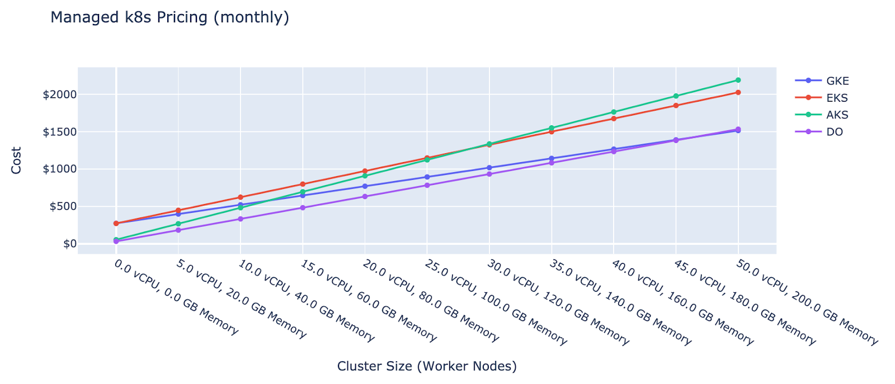

# Continuous Delivery and Deployment

Overview of section contents:

| Section | Descroption |
|-------------|-------------|
| Cloud deployment | The container as service is favored in NSDF|
| Artifacts Repositories | NSDF adopts the most widely-used channels to share NSDF artifacts based on C/C++, Python, Docker, and Kubernetes.|
| Deployment staging | Helm to provide development staging environment for internal usage|
| Docker Containerization  | NSDF suggests using Docker as the standard containerization tool and UDocker as an alternative funder certain special situations |
| Kubernetes Orchestration | Orchestration workflow|
| HPC deployment | Recommendation of container engines for HPC|

---

Continuous Deployment (CD) is a software development discipline where \_software is built in such a way that it can be released to production at any time and minimize the time between production iterations (see [https://martinfowler.com/bliki/ContinuousDelivery.html](https://martinfowler.com/bliki/ContinuousDelivery.html) )

In literature there is usually a clear distinction between the delivery and the deployment phase:

-   **Continuous Delivery** means that artifacts are built and made ready to be deployed. But they will not be deployed without a manual decision by a human being.
-   **Continuous Deployment** implies all processes are automated, and a single commit triggers an automated pipeline that will eventually bring a new version of your application to the production environment without any human intervention



<p align='center'>Continuous integration vs. continuous delivery vs. continuous deployment (source Atlassian CI/CD)</p>


While many companies practice _Continuous Delivery_, few embrace Continuous Deployment because it’s riskier: anyone could introduce a bug into production with a simple commit, and there is the need to introduce additional processes to reduce this risk.

Automation is a key driver of productivity in CD. A battery of automated tests must be programmed to verify that new commits are functional before they are automated, and additional tools are required to abort the deployment process and trigger human intervention when the tests reveal *lower-than-expected quality* results or outcomes.

Together with many indubitably advantages, CD adds an _element of risk_ to the software release process, as frequent commits may introduce bugs to the live environment.

Organizations that implement continuous deployment must therefore develop _real-time monitoring_ capabilities of the live environment to rapidly discover and address any technical issues that occur after new releases (see "*Continuous Monitoring* chapter").

To sum up, the major benefits of CD are:

-   _Maintain Capability for Quick Releases_. It enables teams to get their new releases into the production environment as quickly as possible. With CD, we can roll out several deployments per day.
-   _Rapid Feedback Loop_. Developers can assess the impact of new changes by monitoring the deployment and watching users' behavior. And they can make adjustments accordingly.
-   _Reducing Manual Processes with Automation_. CD allows developers to automate the software development process to the greatest extent possible, especially when it comes to “release“ testing. Automation helps developers push out releases faster and spend less time on manual processes.

NSDF will:

- first implement _Continuous Delivery \_by adding libraries or container images to an Artifact Registry_, allowing stakeholders/research scientists/partners to install binaries and start experiments with them.

- in the second phase of the pilot, since ssh-ing into a cluster and running commands is an unsustainable and error-prone practice, we will gradually introduce a full-fledged \_deployment \_on multi-regional lightweight Kubernetes clusters.

  

## Cloud Deployment 

We have several choices to deploy NSDF applications to the cloud:

- **Infrastructure as a Service (IaaS)**.  

  - A cloud service provider (CSP) hosts the hardware components, including servers, storage, and networking hardware, as well as the virtualization or hypervisor layer
  - Examples: `AWS EC2`, `Google Compute Engine`, `Microsoft Azure`, etc.

- **Software as a Service (SaaS)** 

  - it eliminates the need to install and run applications on the servers. It provides standalone and ready-to-use software on the cloud. This eliminates the expense of hardware procurement, provisioning, and maintenance as well as software licensing, installation, and support.
  - Examples: `Dropbox`, `Slack`, `Microsoft Office 365`, etc.

- **Platform as a Service (PaaS)** 

  - A provider forms and supplies a strong and optimized environment in which users can install applications and datasets.
  - Examples: `AWS Lambda`, `AWS Elastic Beanstalk`, `Heroku`, etc.

- **Container as a Service (CaaS)** 

  - It is a cloud-based service that allows software developers and IT departments to upload, organize, run, scale, and manage containers by using container-based virtualization. CaaS abstracts the full stack in a very compelling way, without the many challenging surprises existing in both IaaS and PaaS.

  - Examples: `Kubernetes`, `Docker Swarm`, `Apache Mesos`, etc.

    



<p align='center'>Differences between "As a service" architectures</p>

For the NSDF pilot the:

- **IaaS approach is admitted**. But NSDF is cloud-agnostic with no special preferences for commercial solutions. In general, we prefer to install orchestration tools on top computing instances.

- **SaaS/PaaS approach is discouraged**: most of the time they are \_vendor-lock-in_ and _pay-per-use_ solutions. An exception is made for the *Function As a Service* (FaaS), a subset of PaaS, but only limited to open-source projects (e.g. OpenFaaS, Kubeless, OpenWhisk, etc. see See [A (Very!) Quick Comparison of Kubernetes Serverless Frameworks – VSHN AG](https://www.vshn.ch/en/blog/a-very-quick-comparison-of-kubernetes-serverless-frameworks/) )

- **CaaS hybrid approach is probably the best** for our pilot, where some services are deployed in the public cloud and some other services are deployed on-premises (i.e. local clusters):

  -   CaaS permits to deploy quickly and lightly on almost any infrastructure;
  -   CaaS provides commodified, standardized functionality on-premise and/or on public clouds;
  -   CaaS offers open container technology, which is the de-facto standard in the cloud industry;
  -   CaaS offers freedom and flexibility to developers.

  

## Artifacts Repositories


Software releases should be made available through an _Artifacts Repository Manager_, defined on Wikipedia as:

> …a software tool designed to optimize the download and storage of binary files used and produced in software development. It centralizes the management of all the binary artifacts generated and used by the organization to overcome the complexity arising from the diversity of binary artifact types, their position in the overall workflow, and the dependencies between them.


The best practice is to follow the standard community consensus and make releases available through the most widely-used common channels.

Currently, our top choices to share NSDF artifacts are based on the programming languages:

- **C/C++**

  - `Windows` using the specific Microsoft Visual Studio distributing the proper *Microsoft Run-Time Kit* 
  - `macOS` using the `MacOSX10.9.sdk` for portability on any recent macOS version
  - `Linux` using [manylinux](https://github.com/pypa/manylinux) (or `manylinux2014`, or `manylinux_x_y`) for broad compatibility with Linux distributions

- **Python**

  -  All public Python libraries must be released through [PyPi](https://packaging.python.org/en/latest/tutorials/packaging-projects/).
  - NSDF libraries with complex compilation requirements will be released to [Conda-Forge](https://conda-forge.org/), which can produce platform-specific compiled versions.

- **Docker**

  - A Docker image represents binary data that encapsulates an application and all its software dependencies.  
  - An image of an application is created and pushed to a registry. Images must be named as follows and tagged with the current version: `nsdf/image-name:v1.0.0` .
  - NSDF recommends using GitHub (or GitLab) as a public Container [Registry](https://docs.docker.com/registry/introduction/). (see [Github Container Registry](https://github.com/features/packages))

- **Kubernetes**

  - YAML files can be versioned in a GitHub repository as with code.

  - For Helm, specific distribution NSDF recommends using [Artifact Hub](https://artifacthub.io/).  

    - Artifact Hub allows publishers to list their content in an automated way (see See [https://artifacthub.io/docs/topics/repositories/](https://artifacthub.io/docs/topics/repositories/)).

      

## Deployment staging

* * *

A staging environment is an environment used to deploy software before it goes to production. Staging environments are generally meant to be identical or nearly identical to production.

Staging allows discovering code quality issues, integration problems, and other dependency issues which would not be as obvious in a minimal environment as the developer’s one.

Staging helps to discover _cross-service problems_, for example, a library that may work on a local machine but may not work in the cloud.

A staging environment is typically not made available to the outside, but rather it is made available to an internal user base.



<p align='center'>Different environments. Source: https://medium.com/hackernoon/staging-environments-are-overlooked-heres-why-they-matter-2082d2ee274a</p>

Sometimes staging is replaced by [canary ](https://semaphoreci.com/blog/what-is-canary-deployment)or [blue/green ](https://www.redhat.com/en/topics/devops/what-is-blue-green-deployment)deployments, but this approach still exposes users to bugs and misconfigurations.

Helm simplifies enormously the maintenance of different environments (e.g. staging vs production). It’s sufficient to 1) create a HELM chart 2) create several YAML _value files_, one for each environment 3) isolate resources in different namespaces:

```shell
kubectl create namespace staging
kubectl create namespace production
helm install nsdf-app-staging nsdf-app -n staging    -f values-staging.yaml
helm install nsdf-app-prod    nsdf-app -n production -f values-prod.yaml
```


## Docker Containerization 

* * *

Containerization enables the portability and reproducibility of data and/or code.

There are a plethora of _container engines_. However, it is not guaranteed that a container image generated by one container engine can be utilized by another. In addition, container engines tend to adopt different command lines which further complicate development.



<p align=center>Source: Flexera 2021 State of Cloud Report</p>

**This NSDF pilot will adopt Docker as the standard containerization platform**. Docker images and the corresponding recipes will be provided via our project registries.

[Udocker](https://github.com/indigo-dc/udocker) can be considered when the installation of Docker or other HPC containers is not possible e.g. user namespace is disabled. Udocker is a Python wrapper that can provide a chroot-like environment over the extracted Docker container.


## Kubernetes Orchestration

* * *

To facilitate management and deployment of applications and clusters NSDF recommends using Kubernetes, Ansible, and Openstack.

Kubernetes, often abbreviated as “K8s,” automates the scheduling, scaling, and maintenance of containers in any infrastructure environment. Open-sourced by Google in 2014, Kubernetes is now part of the *Cloud Native Computing Foundation *(CNCF).

Since its introduction in 2014, Kubernetes has been steadily gaining in popularity across a range of industries and use cases. Recent research shows that almost one-half of organizations running containers were using Kubernetes.

Kubernetes is widely-used in Cloud, while Ansible and Openstack have also seen their usage in HPC centers. Ideally, the orchestrators can automatically pull the container images from the project registry or build the images for users by Ansible or Kubernetes.

Advanced users can also provide their recipes and the orchestrators will build the images for users.

The overall orchestration workflow can be divided into three stages:

1. Ansible/Openstack scripts to deploy the clusters.

2. Container image provision and container management by Ansible/Kubernetes.

3. Container deployments across clusters.

   

A Kubernetes deployment is made of:

- **Cluster**. A K8s cluster has two basic components:

  -  a *control plane* that works to maintain the cluster in the desired state as configured by the user. It consists of 4 key services for cluster administration:
    - *the API server* exposes the K8s API for interacting with the cluster;  
    - the _Controller Manager_ watches the current state of the cluster and attempts to move it toward the desired state; 
    - the *Scheduler* assigns workloads to nodes;  
    - ` etcd` stores data about cluster configuration, cluster state, and more
  - the  *nodes* that handle application workloads.

- **Pods**. Each node in the K8s cluster runs one or more K8s pods.

  - A pod is a group of containers with shared storage, network resources, network namespace, IPC namespace, and operational specifications. 
  - K8s will always schedule containers within the same pod together, but each container can run a different application.
  - The containers in a given pod run on the same host and share the same IP address, port space, context, namespace, and even resources like storage volumes.

- **Containers**.  A container is an executable piece of software that includes an application and all of its related configuration files, libraries, and dependencies.

  - Pods can contain more than one container if their functions are tightly coupled.

- **Containerized Applications** are executable software programs that have been packaged in containers along with their related dependencies.

- **Host Machines**. K8s can run on bare metal servers, virtual machines, on-prem services, or in the public cloud.

  



<p align=center>Kubernetes architecture. For high availability, at least three nodes should be in charge of the control plane</p>

On each node, there is a `kubelet` agent that receives instructions from the API server and makes sure all the containers are running properly.

Kubernetes automates container infrastructure via:

-   Container scheduling and auto-scaling
-   Health checking and recovery
-   Replication for parallelization and high availability
-   Internal network management for service naming, discovery, and load balancing
-   Resource allocation and management

For single-node testing, NSDF recommends using [MicroK8s](https://microk8s.io/) or even a simpler [Docker Compose](https://docs.docker.com/compose/).



<p align=center>Different Kubernetes distributions. Source: https://medium.com/geekculture/state-of-managed-kubernetes-2021-43e8a4ca0207</p>

For multi-host deployment we are currently experimenting with (in the current order of preference):

-   [K3s](https://k3s.io/). A very lightweight K8s installation, with a single-file script with the option to add multiple workers/ high availability.
-   [kubespray](https://github.com/kubernetes-sigs/kubespray). Kubespray is a combination of Kubernetes and Ansible. We can also deploy clusters using kubespray on cloud compute services like EC2 (AWS).
-   [kubeadm](https://kubernetes.io/docs/setup/production-environment/tools/kubeadm/create-cluster-kubeadm/) Kubeadm automates the installation and configuration of Kubernetes components such as the API server, Controller Manager, and Kube DNS. Kubeadm performs the actions necessary to get a minimum viable cluster up and running quickly. By design, it cares only about bootstrapping, not about provisioning machines (underlying worker and master nodes). Kubeadm also serves as a building block for higher-level and more tailored tooling.

Another option would be to use commercial and managed cloud vendors solutions (see [Setup Kubernetes on different vendors](https://zero-to-jupyterhub.readthedocs.io/en/latest/kubernetes/index.html)) that have undoubtedly the advantage of freeing us for maintaining the cluster and worrying about the infrastructure underneath.  But, at the same time, this solution is more expensive and we need to be careful about the fact that pricing is not always 100% transparent and/or simple to estimate.

Also, **EGRESS costs can be an important, if not dominant, piece of the overall costs,** in particular for this pilot where big data will be frequently moved between K8s clusters.

Looking at the table below it’s noticeable that even with low computing resources (a total of 50 vCPU and 200 GiB RAM, which could be barely considered a real cluster for production purposes) costs immediately grow up to _some thousands per month_.

For these reasons, we believe that the adoption of commercial cloud should be limited and may be reconsidered only in the presence of ad-hoc agreements, waivers for EGRESS, and special educational pricing.



<p align=center>Cost estimation of a minimal Kubernetes cluster.  
    <br>Source: https://devopsdirective.com/posts/2020/03/managed-kubernetes-comparison</p>

## High-Performance Computing Deployment

* * *

For High-Performance Computing (HPC), with tens of thousands of massively parallel systems, the overhead introduced by Docker containers is simply unsustainable and we should look to alternatives.

A brief comparison is given in the following list:

- [**Charliecloud**](https://github.com/hpc/charliecloud) 
  -  an open-source project based on a user-defined software stack (UDSS). 
  - Like most container implementations, it uses Linux user namespaces to run unprivileged containers. 
  - It is designed to be as minimal and lightweight as possible, to the point of not adding features that could conflict with any specific use cases.
- [**Shifter**](https://github.com/NERSC/shifter) 
  - is another container run-time implementation focused on HPC users. 
  - It is almost exclusively backed by the National Energy Research Scientific Computing Center and Cray. 
  - Most documented use cases use Slurm for cluster management/job scheduling. 
  - It uses its own specific format, but this is reverse-compatible with Docker container images.
- [**Apptainer**](https://apptainer.org/) (ex Singularity) 
  - is written in Golang. 
  - It supports two image formats: Docker/OCI and Singularity’s native 
  - There are lots of systems running Singularity (including users like TACC, San Diego Supercomputer Center, and Oak Ridge National Laboratory).
  - Admin/root access is not required to run Singularity containers and it requires no additional configuration to do this out of the box.
  - A fork maintained by Sylabs  also distributes a mostly feature compatible version using [SingularityCE](https://sylabs.io/singularity/)/PRO/Enterprise branding.
- [**Podman**](https://podman.io/) 
  - is a container run-time developed by Red Hat. 
  - Its primary goal is to be a drop-in replacement for Docker. 
  - While it is not explicitly designed with HPC use cases in mind, it intends to be a lightweight “wrapper” to run containers without the overhead of the full Docker daemon. 
  - The Podman development team is recently looking into better support for HPC use cases.


**NSDF has a preference for Apptainer/Singularity** since 

1) it’s the most-accepted container engine in HPC communities 

2) it is already used _internally \_by NSDF developers,_ \_and 

3) IBM cloud, one of the partners supporting this pilot, is providing it out-of-the-box.

   

[UDocker ](https://github.com/indigo-dc/udocker)can be an alternative option when the aforementioned HPC containers are unavailable, e.g. namespace may be disabled on certain HPC systems. Installation of Docker is not required for usage of Udocker whose installation can be performed on the user home directory that does not demand any privileged operations. Containers can run in Chroot-like environments with the extracted container images placed in `$HOME/.udocker` by default.


## Links/Bibliography

List:

-   [Deployment Strategies In Kubernetes](https://auth0.com/blog/deployment-strategies-in-kubernetes/)
-   [K3s: Lightweight Kubernetes](https://k3s.io/)
-   [Bare Metal Kubernetes with MetalLB, HAProxy, Longhorn, and Prometheus](https://medium.com/geekculture/bare-metal-kubernetes-with-metallb-haproxy-longhorn-and-prometheus-370ccfffeba9)
-   [Kubernetes-sigs/kubespray: Deploy a Production Ready Kubernetes Cluster ](https://github.com/kubernetes-sigs/kubespray)
-   [Deploy a Production-Ready On-Premise Kubernetes Cluster ](https://towardsdatascience.com/deploy-a-production-ready-on-premise-kubernetes-cluster-36a5d62a2109)
-   [Install a Kubernetes load balancer on your Raspberry Pi homelab with MetalLB](https://opensource.com/article/20/7/homelab-metallb)
-   [How to install Kubernetes on Ubuntu 20.04 ](https://linuxconfig.org/how-to-install-kubernetes-on-ubuntu-20-04-focal-fossa-linux)
-   [Install Kubernetes Cluster on Ubuntu 20.04 with kubeadm](https://computingforgeeks.com/deploy-kubernetes-cluster-on-ubuntu-with-kubeadm/)
-   [Setup On-premise Kubernetes with Kubeadm, MetalLB, Traefik, and Vagrant](https://pgillich.medium.com/setup-on-premise-kubernetes-with-kubeadm-metallb-traefik-and-vagrant-8a9d8d28951a)
-   [Kubernetes Lab on Baremetal ](https://www.marcolancini.it/2021/blog-kubernetes-lab-baremetal/)
-   [From Zero to Code: Moving from Docker to Kubernetes ](https://tech.davidfield.co.uk/from-zero-to-code-moving-from-docker-to-kubernetes/)
-   [Deploy a Production-Ready On-Premise Kubernetes Cluster](https://towardsdatascience.com/deploy-a-production-ready-on-premise-kubernetes-cluster-36a5d62a2109)
-   [Ultimate Cloud Pricing Comparison: AWS vs. Azure vs. Google Cloud in 2021 - CAST AI](https://cast.ai/blog/ultimate-cloud-pricing-comparison-aws-vs-azure-vs-google-cloud-in-2021/)
-   [An introduction to Kubespray ](https://www.redhat.com/sysadmin/kubespray-deploy-kubernetes)
-   [HPC workloads in containers: Comparison of container run-times](https://blog.jwf.io/2019/08/hpc-workloads-containers/)
-   [Staging Environments Are Overlooked — Here's Why They Matter ](https://medium.com/hackernoon/staging-environments-are-overlooked-heres-why-they-matter-2082d2ee274a)

    ​      