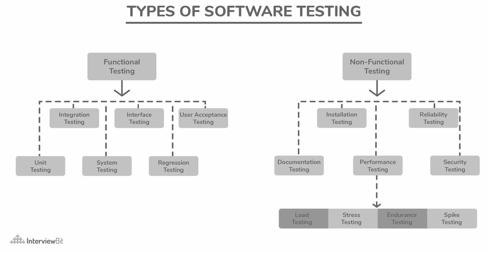

# Continuous Testing

Overview of section contents:

| Section                     | Description                                                  |
| --------------------------- | ------------------------------------------------------------ |
| Test-driven development     | NSDF recommends using TDD just for limited use cases         |
| Unit testing and frameworks | Recommendation for software unit tests in order to improve software quality |
| Other tests                 | A few other software tests to improve quality                |
| Code Analysis               | Open-source tools for code analysis, particularly for C/C++ and Python |

---

> *Print statements are not suitable for testing.*  *They are just bad practices*


Continuous Testing is a defense against software defects across the software life cycle and it means _continuous feedback_ on software quality.

This process is also known as _shift-left testing_, which stresses the concept of integrating development and testing activities to ensure quality is _built-in_ as early as possible.


## Test-driven development


*Test-driven development* (TDD) is a software development process that relies on the repetition of a short development cycle:

-   first, the developer writes a failing test case that defines a desired function;
-   then he produces code to pass the test;
-   refactors the code to acceptable standards.

Test-driven development is related to the _test-first programming_ concept of _Extreme Programming (see _[Going Agile With The Test-First Development Approach](https://www.qmetry.com/blog/going-agile-with-the-test-first-development-approach/#:~:text=Test%2DFirst%20development%20or%20TDD,is%20design%20thinking%20in%20effect)) and is often linked to an agile programming approach.

**NSDF recommends using TDD just for limited use cases.**  Our Software Stack implies too many integrations and complex interactions between different parts to be dealt with TDD.


## Unit testing and frameworks


Unit testing is a method to demonstrate the correct behavior of the software. It’s the verification process to ensure that each software unit does what it’s required to do in terms of code safety, security, and reliability.

Unit testing must be an integral part of NSDF software development.

The adoption of unit tests has several benefits:

-   _facilitate changes:_ unit tests allow programmers to refactor code at a later date, and be sure that code still works correctly;
-   _simplify integration_: unit testing may reduce uncertainty in the units themselves and can be used in a bottom-up testing style approach.
-   is _living documentation_ for the system: developers can look at the unit test's code to gain a basic understanding of the APIs.

### Mocking

Mock objects can simulate the behavior of real objects and they are very useful when a complex object is impractical to incorporate into a unit test. Mock objects can be used to

-   supply non-deterministic results (e.g., current time);
-   reproduce difficult states (e.g. a network error);
-   reproduce slow states (e.g. simulate a database)

Mock objects have the same interface as real objects they mimic, allowing a client object to remain unaware of whether it's using a real object or a mock object.  Mock object frameworks allow the programmer to 

1) specify which methods will be invoked on a mock object, 

2) what parameters will be passed to them, as well as 

3) what values will be returned.

   

For example this PropHolder class:

```cpp
class PropHolder {
public:
    PropHolder()  { }
    virtual ~PropHolder() { }
    virtual void SetProperty(const std::string& name, int value) = 0;
    virtual int GetProperty(const std::string& name) = 0;
};
```

can be mocked into a new class:

```cpp
class MockPropHolder: public PropHolder {
public:
    MockPropHolder() { }
    virtual ~MockPropHolder() { }
    MOCK_METHOD2(SetProperty, void(const std::string& name, int value));
    MOCK_METHOD1(GetProperty, int(const std::string& name));
};
```

and, during unit testing, we will specify its behavior:

```cpp
AUTO_TEST_CASE(test_gmock)
{
  MockPropHolder mholder;
  EXPECT_CALL(mholder, GetProperty(std::string("test"))).Times(1).WillOnce(Return(101));
  EXPECT_CALL(mholder, SetProperty(std::string("test2"),555));
  TestClass(mholder).doCalc();
}
```


### Unit testing frameworks

*Unit test frameworks* simplify the development of unit tests. 

The most well-known frameworks belong to the [xUnit](https://en.wikipedia.org/wiki/XUnit) family of frameworks (CppUnit, NUnit, etc.).

Frameworks from this family rely on:

-   _Assertions_, that check individual conditions;
-   _Test cases_, that combine several assertions, based on some common functionality;
-   _Test suites,_ that combine several tests, logically related to each other;
-   _Fixtures_, that provide setup of data or state, needed for execution of some tests, and cleanup of state and/or data after the test is finished.
-   \_Frameworks \_that control how tests are executed and collect failed tests.

Writing unit tests is a non-trivial time-consuming process: they should cover all public functions, main paths common and edge cases, etc (see [this link](https://geosoft.no/unittesting.html)).


### C++ Unit testing

There are many unit testing frameworks for C++ (see [Wikipedia list of unit testing frameworks](https://en.wikipedia.org/wiki/List_of_unit_testing_frameworks#C.2B.2B)).

NSDF recommends using one of the following (in no particular order of preference):

- [Google C++ Testing Framework](https://code.google.com/p/googletest/) is an open-source project hosted at GitHub, and it can be used on all platforms. Plus it has full support for mocking (see the _Google Mocking framework_).
- [Boost.Test](https://www.boost.org/doc/libs/1_75_0/libs/test/doc/html/index.html) was created by several people on the C++ standards committee. It’s popular with developers who use the other Boost libraries. It has excellent documentation and handles particularly well exceptions and crashes. It lacks mocking features
- [banditcpp](https://github.com/banditcpp/bandit) is a modern C++ unit testing framework with support for Lambdas. It’s available under the open-source license, and it supports C++11.
- [CppUnit ](https://sourceforge.net/projects/cppunit/)is the C++ porting of the JUnit framework. It may be hard to use because of the lack of documentation.


### Python Unit testing

There are a lot of good and advanced Python libraries to perform unit testing (e.g. [robotframework](https://pypi.org/project/robotframework/), [doctest](https://github.com/doctest/doctest), [nose2](https://pypi.org/project/nose2/), [testify](https://pypi.org/project/testify/), etc).

NSDF recommendation is to use either the standard built-in Python Library [unittest](https://docs.python.org/3/library/unittest.html) or the [pytest](https://pypi.org/project/pytest/), used for example by NumPy.

An example of a Python unit test for a factorial function:

```python
import unittest
import math
import factorial_v1
from test import test_support
class FactorialTest(unittest.TestCase):
    def setUp(self):
        print("setup")
    def tearDown(self):
        print("cleanup")
    def test_positives(self):
        for x in range(0,10+1):
            act = math.factorial( x )
            val = factorial_v1.fact( x )
            self.assertAlmostEqual( act, val, 1e-1 )
    def test_negative(self):
        passed = False
        try:
            factorial_v1.fact( -3 )
        except Exception as e:
            passed = True and (e.message.find("Cannot calculate")>= 0 )
        self.assertTrue( passed )
if __name__ == "__main__":
    test_support.run_unittest(FactorialTest)
```


### Go Unit Testing

The Go programming language comes with a built-in unit testing framework. This framework has been standardized across projects. The package is “testing”, and the command is `go test`. Go will look for files named `\*\_test.go` files. The testify require package makes assertion testing easier with intuitive functions to call.

```go
package mcmodel
import(
   “errors”
   “testing”
   “github.com/stretchr/testify/require”
func TestQueryDataset(t *testing.T) {
    x := 5
    // Two ways to test with and without testify
    // Without testify
    if x != 5 {
       t.Errorf(“Expected x == 5, got %d”, x)
    }
   // with testify
    require.Equal(t, 5, x, “x should be 5”)
}
```


## Other tests

There is extensive literature about manual or automatic testing. It’s out of scope to cover them all.



<p align='center'>Types of software testing</p>

But just to name a few that could be adopted for the NSDF software stack:

-   **Integration testing** to test whether multiple software components function well together as a group.
-   **Regression testing**: to verify that the recent changes or updates have no negative effect on the already existing functionality.
-   **Interoperability testing**: to check if the software can interact with other components without any compatibility issues.
-   **Availability/Disaster recovery testing**: it is also a measure of how long failures will last and how much time the repair can take.
-   **Compatibility/Portability testing**: how seamlessly the product operates with other components: OS, browsers, hardware, etc...
-   **Scalability/Load /Stress testing**. ensures that the application can grow in proportion to the increasing demands of the end-users.  It checks the quality of the system under high-peak loads.
-   **Security testing** tries to find the system’s vulnerabilities and determine how confidential data and internal resources are protected.
-   **Maintainability testing** measure the ability to safely go through changes and updates.


## Code Analysis

NSDF recommends adding to the CI/CD pipeline either static analyzers, runtime checkers, or code coverage tools.

Code coverage refers to how much of your code is being executed while your automated tests are running. This metric is calculated by special tools that add tracing calls inside the binaries of your code. This insight into your applications can inform future development, for example: (_) finding what parts of your code are covered by your tests (_) finding what parts of your code are not covered by tests (\*) removing dead code.

Code coverage cross-language tools include:

- [Codecov](https://about.codecov.io/) with unified coverage and separate coverage

- [Coveralls.io](https://coveralls.io/) is free for open source repositories and very popular

  

### C++ Code Analysis

For C++ this is a non-exhaustive list of _static analyzers_:

- [Cppcheck](https://cppcheck.sourceforge.io/) provides code analysis to detect bugs, undefined behavior, and dangerous coding constructs
- [cppclean](https://github.com/myint/cppclean)  is focused on finding problems in C++ sources that slow the development of large codebases
- [codechecker](https://github.com/Ericsson/CodeChecker) is built on the LLVM/Clang Static Analyzer toolchain
- [Flint++](https://github.com/JossWhittle/FlintPlusPlus) is a cross-platform, zero-dependency program developed and used on Facebook.
- [OCLint](https://oclint.org/) reduces defects by inspecting C, C++, and Objective-C code

For code coverage, we suggest adopting open-source tools well integrated into the CI pipeline such as [Codecov](https://about.codecov.io/) or [Coveralls.io](https://coveralls.io/).


### Python Code Analysis

In the Python arena, [Coverage.py](https://coverage.readthedocs.io/en/latest/) is one of the most complete and well-maintained projects.

Also worth mentioning are:

-   [Codacy](https://www.codacy.com/) , Code quality, and coverage grouped by file
-   [Scrutinizer CI](https://scrutinizer-ci.com/) , Code Quality, and coverage grouped by class and function

Besides code coverage, various tools for static analysis and linting ([Mypy](http://mypy-lang.org/), [Pylint](https://pylint.org/) , [Flake8](https://flake8.pycqa.org/en/latest/)) as well as automatic code formatting ([Black](https://github.com/psf/black)) options exist for Python.


## Links/Bibliography

List:

- [http://alexott.net/en/cpp/CppTestingIntro.html](http://alexott.net/en/cpp/CppTestingIntro.html)
- [Unit Testing Guidelines](https://geosoft.no/unittesting.html)
- [Ten C++ Testing Tools for Developers to Consider](https://www.codeguru.com/cplusplus/ten-c-testing-tools-for-developers-to-consider/)
- [Unit Test Frameworks](https://www.amazon.com/gp/product/0596006896?ie=UTF8&tag=aleottshompag-20&linkCode=as2&camp=1789&creative=390957&creativeASIN=0596006896)
- [Practical Testing](http://www.lenholgate.com/blog/2004/05/practical-testing.html)
- [Unit Testing Frameworks in Python](https://www.zenesys.com/blog/unit-testing-frameworks-in-python)
- [Python Unittest Vs Pytest](https://www.pythonpool.com/python-unittest-vs-pytest/)
- [Automated Regression Testing: A Comprehensive Guide](https://www.perfecto.io/blog/automated-regression-testing)
-   [Functional Vs Non-Functional Testing: Expert Guide - UTOR](https://u-tor.com/topic/functional-vs-non-functional)
- [The Best Code Coverage Tools By Programming Language](https://about.codecov.io/blog/the-best-code-coverage-tools-by-programming-language/)
- [Use the Tools Available · C++ Best Practices](https://lefticus.gitbooks.io/cpp-best-practices/content/02-Use_the_Tools_Available.html)
- [Automated Defect Prevention: Best Practices in Software Management | Wiley](https://www.wiley.com/en-us/Automated+Defect+Prevention%3A+Best+Practices+in+Software+Management-p-9780470042120)
- [Github Action for Unit Testing](https://medium.com/@dev.soni04/github-action-for-unit-testing-57faefc9633)
- [Unit testing - Wikipedia](https://en.wikipedia.org/wiki/Unit_testing)
- [Guide: Writing Testable Code](http://misko.hevery.com/code-reviewers-guide/)
