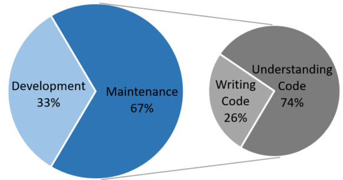
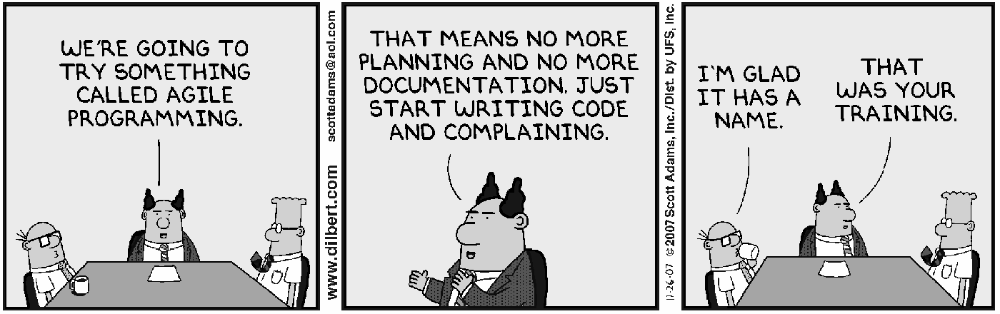
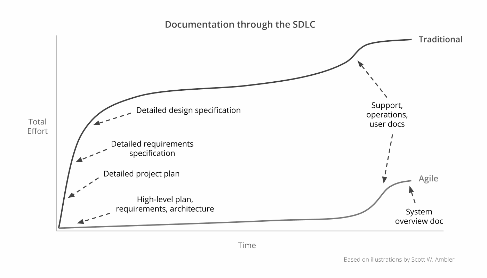
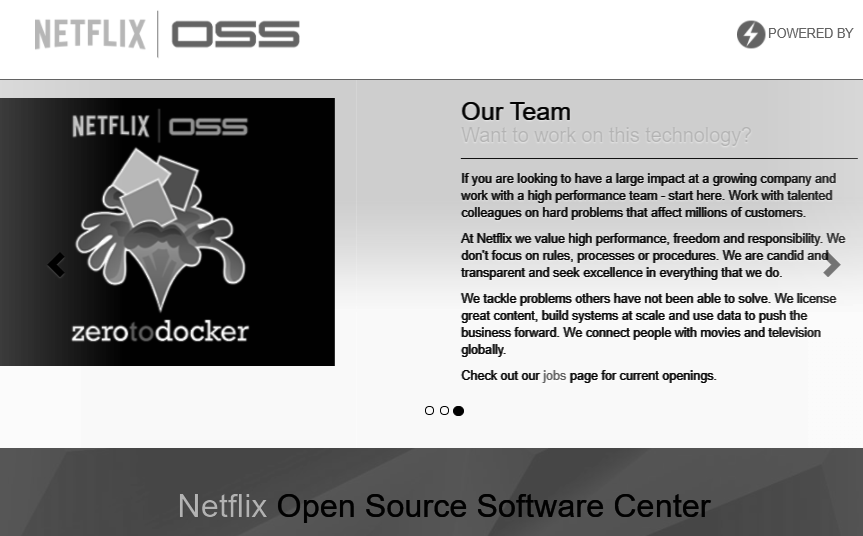
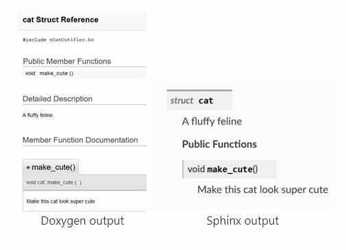
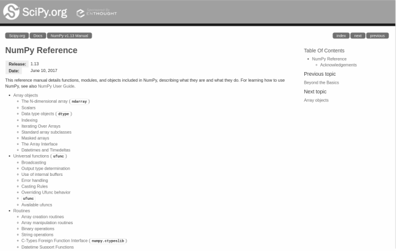

# Continuous Documentation

Overview of section contents:

| Section               | Description                                                  |
| --------------------- | ------------------------------------------------------------ |
| Markdown              | The Markdown language for lightweight documentation          |
| Documentation as code | NSDF recommendation is to follow the “_Documentation of code_” philosophy as closely as possible |
| Code as Documentation | Code in a way that is more readable and self-explaining, particularly practices for C++ and python |
| Documentation tools   | Documentation using Jupyter Notebook and Web service API     |

---


> _Say what you mean, simply and directly. Don't comment on bad code, rewrite it, Make sure comments and code agree (_[The Elements of Programming Style](https://en.wikipedia.org/wiki/The_Elements_of_Programming_Style) by Brian W. Kernighan and P. J. Plauger)



Documenting Software is an important activity of development and it is fundamental for _software maintenance \_and \_knowledge transfer._

But writing too much and too verbose documentation could be a problem itself, and for this reason, NSDF recommends following some principles contained in the “Agile Manifesto” (written by seventeen software developers on February 11-13, 2001, at The Lodge at Snowbird, a ski resort in the Wasatch mountains of Utah see [Manifesto for Agile Software Development](https://agilemanifesto.org/iso/en/manifesto.html)):

> *We embrace documentation, but not hundreds of pages of never-maintained and rarely-used tomes  
> [...]* 
> *While there is value in the comprehensive documentation we value working software more.*

Documenting software is always an *imperfect compromise*: too much documentation would be a waste of time, and developers will rarely trust it anyway because it's usually out of sync with the actual code. On the other hand, too little documentation is always a source of problems with team communication, learning, and knowledge sharing.



So NSDF's major recommendation is to “_document code efficiently_”:

- Write only the minimum, useful, accurate documentation
  - Make sure documentation is “_just barely good enough_”.  Any document will need to be maintained later on.<br />If the documentation is light it’s easier to comprehend and update.
- Write it “_just in time_” (JIT).
  - Wait before documenting.
  - Produce documentation when it is needed, not before.
  - System overviews and support documentation are best written towards the end of the software development life cycle.
- Cut out anything unnecessary
  - documentation is only useful if it's accessible.
- Follow code changes; have documents that are always *shippable* 
- Keep documents in one place and make them _accessible online_.
  - Store your product documentation in a place where all the members and external contributors can find it.
- _Collaborate_. Writing documentation is a collaborative and instructive process
  - Every team member should be encouraged to contribute.



<p align=center>Traditional waterful model to document code vs Agile approach.</p>

## Markdown

Markdown is a lightweight markup language that allows you to create web pages, wikis, and user documentation with a minimum of effort. Documentation written in markdown looks exactly like a plain-text document and is perfectly human-readable.

In addition, it can also be automatically converted to HTML, latex, pdf, etc.


## Documentation as Code 

There has long been a mindset to treat documentation and code as separate functions. **But this thinking is _obsolete_.**

Traditional methods of documentation focus on the concept of a printed page. But most documentation in today’s age is never printed: the documentation created with page-oriented methods does not adapt well to different electronic _always-online_ devices.

It’s very instructive to learn from what big IT companies did in the recent past facing the “*documenting code in an efficient way*” problem:

- [Twitter 2014 talk](https://youtu.be/6y4eQ6gYwdU) described how they solved the documentation maintainability problem. Indeed they were probably the first to end up treating their documents like code.
- [Google 2015 talk](https://youtu.be/EnB8GtPuauw) (_Documentation disrupted: how two technical writers change google engineering culture_") Riona Macnamara, a technical writer at Google, confirmed that the major problem was not the lack of documentation, but rather that it was outdated, untrustworthy, and scattered across wikis, Google Sites, Google Docs, etc.
- [Spotify 2019 talk](https://youtu.be/uFGCaZmA6d4) described how they changed their approach in writing internal technical documentation (cit. “_We conducted a company-wide productivity survey. The third-largest problem according to all our engineers? Not being able to find the technical information they needed to do their work_.” ) and announced the [TechDocs](https://backstage.io/blog/2021/09/16/the-techdocs-beta-has-landed) open-source Cloud Native Computing Foundation (CNCF) platform


*Documentation as code* addresses the need for multiple formats and ease of maintenance.

It makes the documentation part of the Continuous Integration (CI) pipeline; and it empowers developers to apply the same methods and tools, such as

- Issue Trackers

- Version Control (Git)

- Plain Text Markup (Markdown, reStructuredText, Asciidoc)

- Code Reviews

- Automated Tests

  

Therefore NSDF recommendation is to follow the “_Documentation of code_” philosophy as closely as possible:

-   Use plain text files (e.g. Markdown file format). This way the documentation can be consumed on any device.
-   Use open-source static site generators to build the files locally (e.g. [Sphinx](https://www.sphinx-doc.org/en/master/), J[ekyll](https://jekyllrb.com/), [Hugo](https://gohugo.io/))
-   Work with files through a text editor (e.g. [Visual Studio Code](https://code.visualstudio.com/), [Sublime Text](https://www.sublimetext.com/), etc.)
-   Store documents in a version control repository (e.g. GitHub) or a collaborative documental environment (e.g. [Slite](https://slite.com/), [Docs in ClickUp™](https://clickup.com/features/docs), etc.).
    -   Online content makes documents easy to consume.
    -   Content exists in one place but can be pulled into other documents as needed
    -   Content is searchable within and across documents,
    -   Content keeps updated with code changes.
-   Collaborate using version control to branch, merge, push, and pull updates.
-   We can add validation tests to check for broken links, improper terms/styles, and formatting errors
    -   As an example, [https://slateci.io/](https://slateci.io/) is the website of a successful NSF project that is using the approach described here.


This approach will help to build and maintain the _NSDF Web Site_ too: we can store Jekyll templates into a central GitHub repository and, on _git-push events_, a workflow will run and automatically build the NSDF website (see the [GitHub Pages](https://pages.github.com/) project for more details).


As an example, [https://slateci.io/](https://slateci.io/), another NSF-funded project for “_Federated Operation of Science Platforms_”  is using Jekyll to produce their website, and collaborating/modifying it’s just a matter of editing markdown documents on GitHub.



<p align=center> Netflix Open Source Software Center (OSS)  is made with GitHub Pages (https://github.com/Netflix/netflix.github.com)</p>


## Code as Documentation


_Code as documentation_ is a principle that advocates making code more readable and self-explaining.   But it does not mean that the code should not be documented, or that it is the only source of documentation.

Regarding this matter, we are quoting the words of a famous post by Martin Fowler (see [https://martinfowler.com/bliki/CodeAsDocumentation.html](https://martinfowler.com/bliki/CodeAsDocumentation.html)):

> *One of the common elements of agile methods is that they raise programming to a central role in software development - one much greater than the software engineering community usually does Part of this is classifying the code as a major, if not the primary documentation of a software system.  [..]    
> I think part of the reason that code is often so hard to read is that people aren't taking it seriously as documentation. [...]* 
> *So the first step to clear code is to accept that code is documentation, and then put the effort in to make it clear. [...]* 
> *We as a whole industry need to put much more emphasis on valuing the clarity of code.*


There are several ways we can assure that our code is clean and easy to understand (For more extensive descriptions see [Clean Code: A Handbook of Agile Software Craftsmanship: Martin, Robert C.](https://www.amazon.it/Clean-Code-Handbook-Software-Craftsmanship/dp/0132350882) ).


### Use intention-revealing names

Give meaningful names to variables, methods, and classes (even if they become long). If the class or method name describes what it does, and if the field name informs what it has, it is not necessary to write a comment to inform it. The idea is that, when we read a variable or method name, we can understand what it does. Below, two code examples show the same variable declaration was written in two different ways.

Bad code:

```cpp
int d; //elapsed time in days
```

Good code:
```cpp
int elapsedTimeInDays;
```


### Refactor long blocks


Big methods are hard to read and understand, mainly if it has a lot of responsibilities. Write small methods. Each method should have only one responsibility and its name should describe it.

If some method is big, extract each functionality in smaller methods. When writing a code, keep in mind that it can be reused in another part of the system itself or other systems.

### Use informative comments

A clean code tells you what it does, but it does not show clearly your intention and why it was done that way. For this, you can use comments, it is an important resource to complement the understanding of the code.

There are special comments like TODO and FIXME, that are used to record reminders to future improvements and corrective tasks. Use them when a code is incomplete, incorrect, or can be improved but you do not have time to make it at this time.

Avoid _redundant_, \_misleading, \_and \_noisy \_comments.

NSDF suggest reading this interesting post [Writing system software: code comments](http://antirez.com/news/124) which differentiate between positive forms of commenting) Functional, Design, Why, Teacher, CheckList, Guide) and somewhat questionable comments (Trivia, Debt, Backup); and it points out a reasonable vision:

> _Many comments don't explain what the code is doing. They explain what you can't understand just from what the code does. Often this missing information is _why_ the code is doing a certain action, or why it’s doing something that is clear instead of something else that would feel more natural._
>
> _While it is not generally useful to document, line by line, what the code is doing because it is understandable just by reading it, a key goal in writing readable code is to lower the amount of effort and the number of details the reader should take into her or his head while reading some code. So comments can be, for me, a tool for lowering the cognitive load of the reader._


### Use class-level documentation

Class-level documentation should describe the purpose of this unit of work and how to use it.   There are conventions to use and best practices; make sure you follow your choice of programming language’s convention and best practices.


### Use method-level documentation


Method documentation describes the purpose of the method and is a more specialized description than the class documentation. There are conventions to use and best practices; make sure you follow your choice of programming language’s convention and best practices.


### Use proper formatting

You should take care that your code is nicely formatted. No one will care to read the code if it’s ugly formatted because it’s a clear sign of a poorly maintained project. NSDF should choose a set of simple rules that govern the format of the code, and these rules should be consistently applied. NSDF developers should agree to a single set of formatting rules and all members should comply.


### Use error handling

Make error handling clean and short: it shows what can go wrong. Use, if possible, exceptions rather than return codes. Add informative and self-contained error messages; add some *context* (e.g. in C++ **FILE**, **LINE**); classify types and gravity of errors. Use a serious and production-ready _logging system_ to keep track of errors and for \_post-mortem \_debugging.


### C++ Documentation


Doxygen is the most widely used C++ documentation tool.

The generated documentation makes it easier to navigate and understand the code as it may contain all public functions, classes, namespaces, enumerations, side notes, and code examples.

Doxygen:

-   Supports a variety of output formats, including HTML and PDF.
-   It can extract the code structure from undocumented source files.
-   It can visualize the relations between the various elements using include dependency graphs, inheritance diagrams, and collaboration diagrams.
-   supports multiple languages (C/C++, Fortran, Objective-C, C#. PHP, Python, etc.)

Several well-known C++ libraries use Doxygen for their documentation (e.g. Apache Portable Runtime, CppUnit, Free Image, GNU Standard C++ Library, KDE, LLVM, OGRE, VTK, here a full list [https://www.doxygen.nl/projects.html](https://www.doxygen.nl/projects.html) ).

But one pain point consists in the fact that generated documents tend to be visually _noisy_, with a style that struggles to represent complex template-based APIs. There are also some limitations to the Doxygen markup language.

To solve this issue, the C++ community is recently switching to [Sphinx](https://www.sphinx-doc.org/en/master/), the most used Python documentation tool, that can be *adapted* to use the Doxygen parser (see [https://devblogs.microsoft.com/cppblog/clear-functional-c-documentation-with-sphinx-breathe-doxygen-cmake/](https://devblogs.microsoft.com/cppblog/clear-functional-c-documentation-with-sphinx-breathe-doxygen-cmake/)):

-   The Sphinx module Breathe parses Doxygen XML output and produces Sphinx documentation.
-   Breathe can be integrated with [Read the Docs](https://readthedocs.org/) to post documentation online (cit “_Technical documentation lives here_”)
-   it supports hybrid syntax, i.e., using reStructuredText in Doxygen markup

The Sphinx-generated documents look more modern and minimal and it’s much easier to swap to a different theme and modify the layout of the pages.

NSDF recommends using the mix Doxygen/Sphinx to document its C++ code.



<p align=center>Visual comparison of Doxygen and Sphinx output</p>

### Python Documentation

There are several ways NSDF can produce Python documentation (see this link [https://wiki.python.org/moin/DocumentationTools](https://wiki.python.org/moin/DocumentationTools) for an exhaustive list).

Some key factors that must influence our choice are:

-   Visual appeal and ease-of-use (where case studies and/or screenshots are available)
-   Potential dependency fragility (most importantly which versions of Python)
-   Community size/engagement and availability of tool support
-   Run-time introspection vs static analysis

[Sphinx](https://www.sphinx-doc.org/en/master/index.html) is the most used and comprehensive Python documentation generator. It supports reStructuredText in docstrings and produces an HTML output with a very clean visual style.

Several Python libraries are using Sphinx document generator (e.g. Flask Django, PyCuda, OpenCV, PyQt5, MatplotLib, Pandas, Conda, Pip, Pillow, PyPy, NumPy, SciPy). Python itself uses Sphinx.  Full list is available here [http://www.sphinx-doc.org/en/master/examples.html](http://www.sphinx-doc.org/en/master/examples.html).

The main features of Sphinx are:

-   Supports a variety of output formats, including HTML and PDF.
-   Easy _cross-referencing_ via semantic markup and automatic links for functions, classes, citations.
-   The simple hierarchical structure of the documentation tree with automatic links to siblings, parents, children.
-   Automatic indices.
-   Extensible.
-   Easy configuration, mostly automatic.

Setting it up requires a bit of configuration. For a quick tutorial look [here](https://leimao.github.io/blog/Python-Documentation-Using-Sphinx/).



<p align=center>Python 3.x and NumPy use Sphinx for documenting their classes</p>

NSDF recommends the use of Sphinx to generate Python documentation.  But alternatives are considered in the following table:

- [pdoc](https://github.com/mitmproxy/pdoc) 

  - is probably the second-most popular Python-exclusive doc tool
  - its code is a fraction of Sphinx’s complexity and the output is not quite as polished,
  - it works with _zero configuration in a single step_.
  - It also supports docstrings for variables through source code parsing. Otherwise, it uses introspection.
  - It is worth checking out if Sphinx is too complicated for the NSDF use case.

- [pydoctor](https://github.com/twisted/pydoctor) 

  - is an API documentation generator that works by static analysis.  
  - The main benefit is that it traces inheritances particularly well, even for multiple interfaces. 
  - It can pass the resulting object model to Sphinx if you prefer its output style.

- [Doxygen](http://www.stack.nl/~dimitri/doxygen/index.html) 

  - is a _not Python exclusive_ documentation generator. 

  - It can generate documentation from undocumented source code (mostly inheritances and dependencies). 

  - Many teams already know this tool from its wide use in multiple languages, particularly C++.

    

## Jupyter Notebooks Documentation


A Jupyter notebook is a document that supports mixing executable code, equations, visualizations, and _narrative text_. Jupyter notebooks allow users to “_bring together data, code, and prose, to tell an interactive, computational story_“.

Jupyter Notebook can combine codes and explanations with the interactivity of the application. This makes it a handy tool for data scientists for streamlining end-to-end data science workflows.

Jupyter Notebooks have played an essential role in the _democratization of data science_, making it more accessible by removing barriers of entry for data scientists.

Jupyter Notebook uses ipywidgets packages for “_live interactions with code_”: code can be edited by users and can also be sent for a re-run, making Jupyter’s code non-static.

Jupyter Notebook makes it easy to explain codes line-by-line with feedback attached all along the way. Users can add interactivity along with explanations, while the code is fully functional.

For all the above reasons, Jupyter Notebooks will be a very important source of documentation about the NSDF software stack,  and it is the best instrument to document code and algorithms.


## Web Services API Documentation

NSDF web services will follow the philosophy of “_microservice architecture_” that is defined as a set of loosely coupled, collaborating services.

The benefits of using such architecture include:

-   Microservices are small, loosely coupled.
    -   Each has its base code, meaning a smaller team is needed to manage this codebase.
-   Microservices can be deployed independently.
    -   This also means that services can be scaled independently as needed.
-   Microservices do not need to share the same technology stack.
    -   One service could be written in one language (e.g. C++); another could be written in a different language (e.g. Python).

To implement microservices NSDF recommends the RESTful API standard.


### Representational State Transfer (RESTful) API

One of the most popular types of APIs for building microservices applications is known as “RESTful API” or “REST API.”

REST API is a popular standard among developers because it uses HTTP commands, which most developers are familiar with and has an easy time using.

Here are the defining characteristics of RESTful API:

-   An API that uses the REST (_Representational State Transfer_) model.
-   Relies on HTTP coding which is familiar to web developers.
-   Uses \_Secure Sockets Layer (\_SSL) encryption.
-   It is _language-agnostic_, it connects apps and microservices written in different programming languages.
-   it simplifies the creation of web applications through _Create, Retrieve, Update, Delete _(CRUD) operations

The HTTP commands, or “verbs”, common to REST API include `PUT`, `POST`, `DELETE`, `GET`, `PATCH`.

Developers use these RESTful API commands to perform actions on different “resources” within an application or service. RESTful APIs use standard URLs to locate resources.

The familiarity and reliability of RESTful API commands, rules, and protocols make it easier to develop applications that integrate with applications that have an associated API.

RESTful API will be used by NSDF to make its services available to the community and to integrate with third-party applications.

### RESTful documentation

RESTful APIs tend to evolve rapidly during development and release cycles.

Maintaining and updating API documentation for the development team and external users is a difficult but necessary process.

To document NSDF API, we are recommending using the *OpenAPI Specification* (OAS).

The _OpenAPI Specification_ (formerly known as _Swagger Specification_) defines a standard and _language-agnostic_ interface to RESTful APIs which allows both humans and computers to discover and understand the capabilities of the service without access to source code, documentation, or through network traffic inspection.

A consumer can understand and interact with the remote service with a minimal amount of implementation logic.

OpenAPI definitions can be written in JSON or YAML. We recommend YAML since it’s also the file format used for Kubernetes deployment.

A simple OpenAPI specification looks like this:

```
openapi: 3.0.0
info:
  version: 1.0.0
  title: NSDF API
  description: A sample API to illustrate an NSDF service
paths:
  /list:
    get:
      description: Returns a list of cloud resources
      responses:
        '200':
          description: Successful response
```

The adoption of OpenAPI will:

-   Help members understand the NSDF APIs and agree on their attributes.
-   Help users to experiment with the APIs (for example using the [_Swagger UI_](https://swagger.io/tools/swagger-ui/)\_ \_open-source tool)
-   Simplify the creation of automatic tests
-   Accelerate the development by automatically generating _stub code_ (i.e. temporary substitute for yet-to-be-developed code)


## Links/Bibliography

List:
- [Google Documentation Best Practices](https://google.github.io/styleguide/docguide/best_practices.html)
- [Agile in Government: Keeping Documentation Lean](https://www.agilealliance.org/resources/experience-reports/agile-federal-space-best-practices-keeping-documentation-lean/)
- [Martin Fowler Code As Documentation](https://martinfowler.com/bliki/CodeAsDocumentation.html)
- [https://www.atlassian.com/agile/manifesto](https://www.atlassian.com/agile/manifesto)
- ['Documentation as code' matters. Here's why](https://blogs.dxc.technology/2019/08/22/documentation-as-code-matters-heres-why/)
- [Agile Development Methodology: To Document or Not to Document?](https://www.nuclino.com/articles/agile-documentation)
- [How to use Markdown for writing documentation | Adobe Experience Cloud](https://experienceleague.adobe.com/docs/contributor/contributor-guide/writing-essentials/markdown.html?lang=en)
- [Documenting API: Docs-as-code tools](https://idratherbewriting.com/learnapidoc/pubapis_docs_as_code.html)
- [Common references and introductory content on Docs as Code](https://cchesser.github.io/docs-as-code/)
- [Write the docs](https://www.writethedocs.org/guide/docs-as-code/)
- [Docs like Code, change case study](https://www.docslikecode.com/articles/change-case-study/)
- [Code as Documentation](https://adadevelopment.github.io/engineering/code-as-documentation.html)
- [OpenAPI Specification - Version 3.0.3](https://swagger.io/specification/)
- [Comparison of Python documentation generators | by Peter Kong | Medium](https://medium.com/@peterkong/comparison-of-python-documentation-generators-660203ca3804)
- [Why we use Jupyter notebooks | Teaching and Learning with Jupyter](https://jupyter4edu.github.io/jupyter-edu-book/why-we-use-jupyter-notebooks.html)
- [Documentation in the modern age](https://www.ima.umn.edu/materials/2018-2019/SW10.15-19.18/27608/coinforgery18-slides.pdf)
- [REST APIs vs Microservices: Differences & How They Work - DreamFactory](https://blog.dreamfactory.com/restful-api-and-microservices-the-differences-and-how-they-work-together/)
- [How to Automatically Generate Clients for your REST API](https://www.linkedin.com/pulse/how-automatically-generate-clients-your-rest-api-roald-nefs/)
- [Daring Fireball: Markdown](https://daringfireball.net/projects/markdown/)
- [Markdown - Wikipedia](https://en.wikipedia.org/wiki/Markdown)
