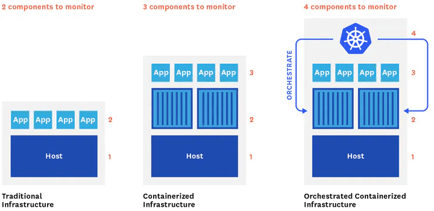
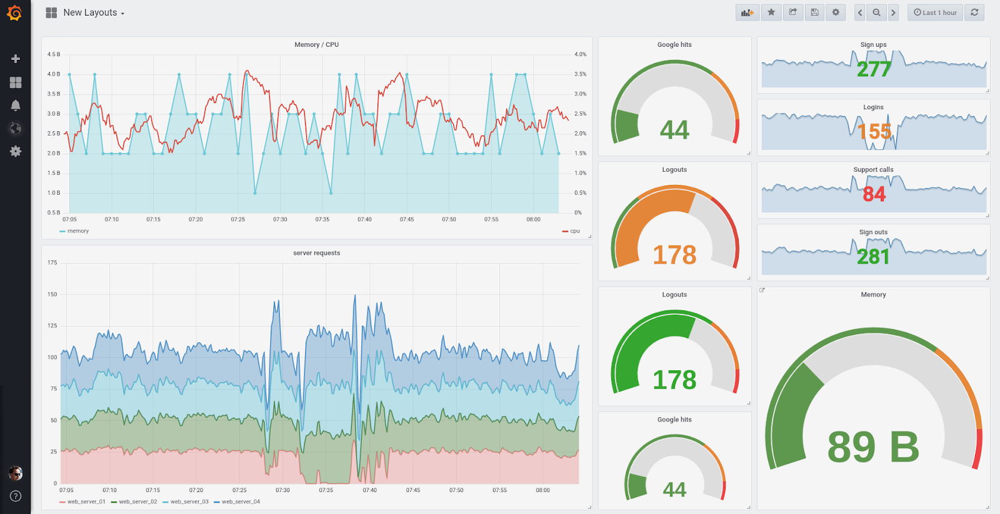
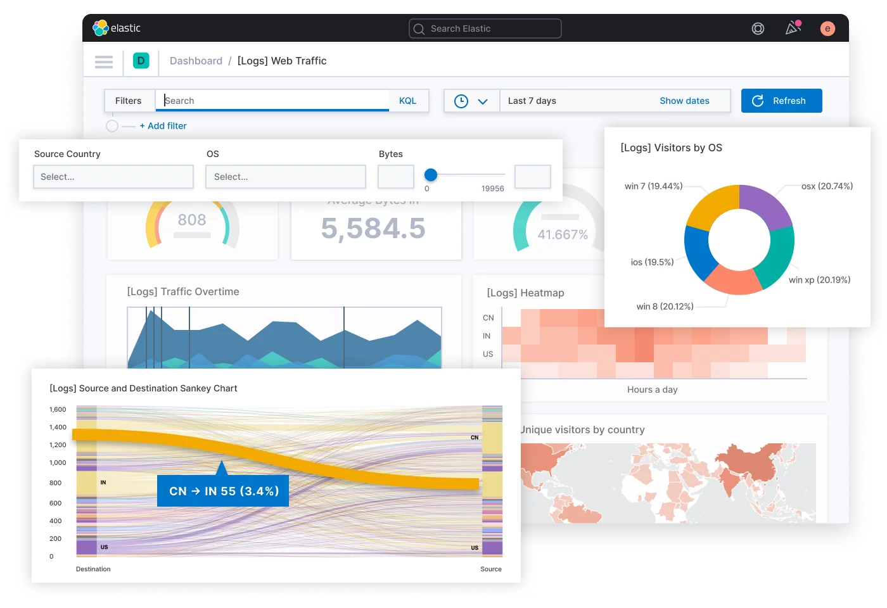

# Continuous Monitoring

Overview of section contents:

| Section               | Description                                                  |
| --------------------- | ------------------------------------------------------------ |
| Kubernetes Monitoring | Automated process to observe and detect compliance issues and security threats, especially with Kubernetes |

---

Monitoring an application’s state is one of the most effective ways to anticipate problems and discover bottlenecks in a production environment. Yet it is also one of the biggest challenges.

The growing adoption of microservices makes logging and monitoring a very complex problem since a large number of applications, distributed and diversified in nature, are communicating, and a single point of failure can stop the entire process.

Continuous Monitoring (CM) is an automated process to observe and detect _compliance issues \_and \_security threats_; it helps to monitor, detect, and study metrics,  and to resolve issues in _real-time_.

CM means monitoring:

- **Infrastructure** that includes data centers, networks, hardware, software, servers, storage, etc. Common metrics to watch are: server availability; CPU; servers; system uptime; database health; disk usage; storage; security etc.
- **Applications** that track software performance. Common measures to track are availability; error rate; throughput; response time; end-user transactions; Service Level Agreement (SLA) etc.
- **Network** or network activity and related hardware (firewalls, routers, switches, servers, etc). It measures latency; multiple port metrics; server bandwidth; packets flow, etc.

## Kubernetes monitoring

Kubernetes runs in more than 70 percent of container environments (see [Kubernetes adoption, security, and market trends report 2021](https://www.redhat.com/en/resources/kubernetes-adoption-security-market-trends-2021-overview) ). And monitoring has become a key way to extract runtime information. which is critical when troubleshooting issues and optimizing performance, both proactively and reactively.

However, Kubernetes presents a unique challenge on two fronts: **setup** and **monitoring**. It’s difficult to nail the deployment in an organized and_ high-performing_ way. Common mistakes involve incorrectly sizing of nodes, consolidating containers, or properly creating namespaces.

Roughly 49 percent of containers use under 30% of their requested CPU allocation, and 45% of containers use less than 30% of the RAM (see See [10 Trends in Real-World Container Use](https://www.datadoghq.com/container-report/) ).  *Real-time monitoring* can help in preventing these problems.

Kubernetes monitoring captures logs and events from the cluster, pods, containers, host machines, and containerized applications.

Three types of Kubernetes metrics can be tracked:

-   **Resource metrics** that include information like CPU, memory usage, filesystem space, network traffic, etc. that can be queried using the _Kubernetes Metrics API_.
-   **Service metrics** include metrics produced by Kubernetes infrastructure, as well as those produced by containerized applications by deploying the Kube-state-metrics component.
-   **Custom metrics** implemented using additional adapters to add metrics through the Kubernetes API aggregation.

In addition to monitoring, engineers may also want to capture _logs \_and \_events_. The simplest way for logging is to write logs to standard output (stdout) and standard error (stderr) streams.  As these logs are created, the kubelet agent writes them into a separate file that can be accessed by the user. This process is known as _node-level logging_.

A significant problem with _node-level logging_ is the instability of logs: when a Kubernetes pod terminates or moves, logs are deleted and this makes it impossible to review them after a crash.

To get around this issue, NSDF will need to set up _cluster-level logging_ not natively supported by Kubernetes since it relies on additional drivers to push logs to the storage back-end.

There are two approaches to set up the \_cluster-level logging \_service:

- use Cloud Native Computing Foundation (CNCF) projects. This approach has the advantage of using open-source projects and being backed up by large and active communities.

- use of _Software as a Service_ (SaaS) software, usually provided by commercial companies as a\_ pay-per-use \_service.

  

### Container Advisor, Prometheus, Grafana

This CNCF monitoring solution is made of a:

- [Container Advisor](https://github.com/google/cadvisor)  is a monitoring tool that exposes data from running containers, including resource usage and performance metrics.
- [Prometheus](https://prometheus.io/)  provides event monitoring and alerting capabilities, including data stored in the form of metrics, time-series data collection, alerts, monitoring, and querying. Prometheus has emerged in the last years as the d_e-facto open-source standard_ for Kubernetes.
- [Grafana](https://grafana.com/)  is a web application for analytics and interactive visualization. It includes charts, graphs, and alerts. There are also many _ready-to-use dashboards_ in [Grafana Labs](https://grafana.com/grafana/dashboards); (e.g. a dashboard to control AWS costs; a dashboard to check the healthiness of an nginx load-balancer, etc).

Example of Grafana dashboard

### ElasticSearch, Logstash, Kibana 

Another solution is to use the “_ElasticSearch + Logstash + Kibana“_ (ELK) stack that is composed by:

- [_Elasticsearch_](https://www.elastic.co/) is \_a distributed, open-source search and analysis engine with full-text indexing capabilities, based on Apache Lucene, Data can be parsed, normalized, and enriched before being indexed.
- [Logstash](https://www.elastic.co/logstash/) is a data collection engine that acts as a data pipeline. Users can aggregate logs and event data from a variety of potential sources and enrich the data with out-of-the-box aggregation and mutations. 
- [Kibana](https://www.elastic.co/kibana/) is a data visualization tool to create histograms, charts, graphs, and other real-time visual representations.

When [_Fluentd_](https://www.fluentd.org/)\ _is used_ _instead of \_Logstash, \_then_ \_the stack is renamed EFK.

ELK/EFK may have some problems with increasingly log volumes.

Example of Kibana dashboard

### Other K8s monitoring/Logging solutions

Some other solutions, that may be worth NSDF considerations, are:

- [Sematext  Monitoring](https://sematext.com/spm/) is a Software as a Service (SaaS) monitoring solution for both traditional and microservice-based applications, capturing metrics and events in real-time.
- [Sensu](https://sensu.io/) is a SaaS solution that is free for &lt;100 nodes. It offers an end-to-end observability pipeline to collect, filter, and transform monitoring events and send them to a database. The metrics can include system metrics, as well as custom application metrics.
- [Logz.io](https://logz.io/) is a SaaS solution that is free for the community with 1 day of log retention (max 1GiB). It’s a fully managed and autoscaling ELK stack and has some ML analytics.
- [Jaeger](https://github.com/jaegertracing/jaeger) is a free tracing tool used for monitoring and troubleshooting in complex distributed systems. It was released and open-sourced by Uber Technologies in 2016. With Jaeger, users can perform root cause analysis, distributed transaction monitoring, distributed context propagations, service dependency analysis, and performance and latency optimization.
- [Kubewatch](https://github.com/bitnami-labs/kubewatch) is a watcher that publishes notifications to available collaboration hubs/notification channels. Once the Kubewatch pod is running, events will start streaming to a Slack channel or other configured webhooks.
- [Weave Scope](https://github.com/weaveworks/scope) is a monitoring tool that allows gaining operational insights and it allows to manage containers and run diagnostic commands within this UI.**Very strong candidate**
- [Fluent Bit](https://fluentbit.io/) is a lightweight data shipper that excels in acting as an agent on edge-hosts, collecting and pushing data down the pipelines.
- [Kubernetes Dashboard](https://github.com/kubernetes/dashboard) is a basic simple-to-setup web add-on for K8s clusters. It exposes basic metrics across all nodes and monitors the health of workloads (pods, deployments, replica sets, cron jobs, etc.).
- [Lens](https://www.mirantis.com/software/lens/) is not a full monitoring solution, but rather a Kubernetes integrated development environment (IDE). The service bundles a contextual terminal with Prometheus statistics while ensuring that logs are easily viewable. Also, real-time graphs are available in the dashboard.

Note that NSDF excluded from the list any professional, production-grade but expensive tools such as [Datadog](https://www.datadoghq.com/), [New Relic](https://newrelic.com/), [Dynatrace](https://www.dynatrace.com/), [Instana](https://www.instana.com/), [Turbonomic](https://www.turbonomic.com/), [Sysdig](https://sysdig.com/), [Splunk](https://www.splunk.com/en_us/hp21.html), etc.

## Links/Bibliography

List:

-   [Top 13 Kubernetes Monitoring Tools](https://sematext.com/blog/kubernetes-monitoring-tools/)
-   [Top 11 Open Source Monitoring Tools for Kubernetes](https://logz.io/blog/open-source-monitoring-tools-for-kubernetes/)
-   [Kubernetes Monitoring: Best Practices, Methods, and Solutions](https://logz.io/blog/kubernetes-monitoring/)

- [Kubernetes Monitoring Dashboards ](https://loft.sh/blog/kubernetes-monitoring-dashboards-5-best-open-source-tools/)

-   [Kubernetes Monitoring - A Simplified Guide](https://www.chaossearch.io/blog/kubernetes-monitoring-guide)
-   [What is Continuous Monitoring in DevOps? ](https://www.browserstack.com/guide/continuous-monitoring-in-devops)
-   [Monitoring in the Kubernetes Era | Datadog](https://www.datadoghq.com/blog/monitoring-kubernetes-era/)

​          