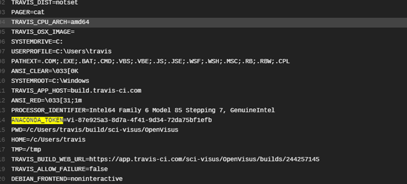
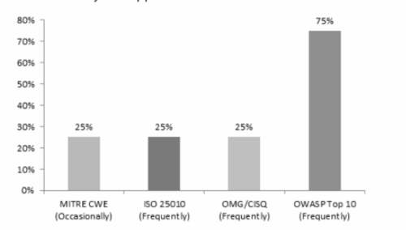

# Software Security

Overview of section contents:

| Section                                       | Description                                                  |
| --------------------------------------------- | ------------------------------------------------------------ |
| Enforce security of sensitive data            | Use vault-like solutions to store sensitive data, such as passwords, security tokens. |
| Enforce security of continuous integration    | ways to prevent the leaking of sensitive information when using Git, such as passwords, tokens. |
| Enforce security of the continuous deployment | Measurements to perform even when the CD tools may have failed to automatically remove the credentials |
| Security scans                                | Security scan to avoid vulnerabilities, particularly Python and Docker images |
| Automatic tools                               | The automatic tools to improve software quality              |

---

This section contains some best practices to keep the NSDF software stack _safe and secure_.


## Enforce Security of sensitive data

The best approaches to store and share passwords, security tokens, sensitive information is:

- Use **2-Step verification**_, also known as _multi-factor authentication_ (MFA) for all users: even if some password WAS stolen, it's almost impossible to log in without a _second device_
- Create_ **short-lived tokens** for any automatic procedure. This means to:(_) create the token and limit as much as possible its scope (_) use the token for a limited timeframe (\*) remove the token while the activity is finished
- Always follow the [**Principle of Least Privilege**](https://docs.aws.amazon.com/IAM/latest/UserGuide/best-practices.html#grant-least-privilege)  i.e. do not create security tokens with \_Full Access \_permissions.
- Configure a **strong password policy** for users, and rotate keys ([link](https://docs.aws.amazon.com/IAM/latest/UserGuide/id_credentials_access-keys.html#Using_RotateAccessKey))

To store sensitive data we suggest using a <u>vault-like solution</u> such as [Confidant](https://lyft.github.io/confidant/) or [HashiCorp Vault](https://www.vaultproject.io/), both free for open source projects.


## Enforce Security of Continuous Integration

Stealing passwords and tokens in a Git public repository can be as easy as running a single line command ([link](https://twitter.com/TomNomNom/status/1133345832688857095) from "Ethical Hacker") which dumps the contents of a repository's object database :

```shell
{ find .git/objects/pack/ -name "*.idx"|\
while read i; \
do git show-index < "$i"|awk '{print $2}';done;f\
ind .git/objects/ -type f| \
grep -v '/pack/'| \
awk -F'/' '{print $(NF-1)$NF}'; }|while read o;do git cat-file -p $o;done|\
grep -E 'pattern'
```

The best approaches for these kinds of security leaks are:

- **Before pushing** to GitHub: use [truffleHog](https://github.com/trufflesecurity/truffleHog) or [gitleaks](https://github.com/zricethezav/gitleaks) (or alternatives) to search for secrets, to dig into commit history and branches, to find secrets accidentally committed.
- **Before pushing** to GitHub: clean up Jupyter Notebooks output or other clean-text documents using [nb-clean](https://github.com/srstevenson/nb-clean) (or alternatives)
- **After pushing** to GitHub: use online open-source scanning solutions such as[ Spectral](https://spectralops.io/security-vs-deployment-with-scan-one-step/?matchtype=e&creative=566587473774&network=g&device=c&keyword=github%20security%20scanning&country=1008736&campaign=15232525134&adgroup=126978626542&position=&utm_term=github%20security%20scanning&utm_campaign=git-security&utm_source=google.com&utm_medium=cpc&hsa_acc=1287660619&hsa_cam=15232525134&hsa_grp=126978626542&hsa_ad=566587473774&hsa_src=g&hsa_tgt=kwd-703389353225&hsa_kw=github%20security%20scanning&hsa_mt=e&hsa_net=adwords&hsa_ver=3&gclid=Cj0KCQiAieWOBhCYARIsANcOw0wfv7lpUjKXbJxT8cPAu9wSOop87TwjKd-WBEr86tIetskNLGvtgpIaAk-4EALw_wcB)


## Enforce Security of Continuous Deployment

All CD tools automatically filter secure _environment variables and tokens r_emoving them from the \_build log_ and replacing them with some _obfuscated_ text. But, once a VM is booted and tests are running, all these tools have less control over what information utilities or add-ons can print to the VM’s standard output.

As an example, just running an `env` command from TravisCI, secrets will be publicly exposed (see [Travis CI Vulnerability Potentially Leaked Customer Secrets](https://www.infoq.com/news/2021/09/travis-ci-secrets-leak/)).



<p align='center'>Example of token leak on TravisCI</p>

Possible countermeasures are:

-   **Drastic** countermeasures: 
    -   do a manual deployment and/or move your CI/CD pipeline on-premise.

-   **Soft** countermeasures:
    -   disable all settings which duplicate commands to standard output (e.g \`set -v ),
    -   disable any displaying environment(e.g. `env` or `printenv`)
    -   avoid printing secrets within the code(e.g. `echo $SECRET_KEY`)
    -   avoid any shell commands that may expose tokens or secure variables (e.g.` git fetch` or `git push`)
    -   avoid mistakes in string escaping
    -   avoid increasing command verbosity if not strictly necessary
    -   redirect output to /dev/null
    -   rotate secrets periodically
-   **Off-the-shell** countermeasures:
    -   use standalone solutions to do the online CD scanning


## Security Scans

NSDF must constantly check source code for the most exploited security **weaknesses and vulnerabilities** in software including the:

- [2021 CWE Top 25 Most Dangerous Software Weaknesses](https://cwe.mitre.org/top25/archive/2021/2021_cwe_top25.html)
- [OWASP Top Ten Web Application Security Risks](https://owasp.org/www-project-top-ten/)

This process should be automatic, ideally running on every new commit (i.e. several times /day), thus limiting the manual intervention to periodic full checks



<p align='center'> Top used industry standards to asset software quality and security.</p>

Also, NSDF recommends finding **Python security issues** using[ Bandit](https://github.com/PyCQA/bandit) (or alternatives):

> _Bandit is a tool designed to find common security issues in Python code. To do this Bandit processes each file builds an AST from it and runs appropriate plugins against the AST nodes. Once Bandit has finished scanning all the files it generates a report._


and performing *safety checks* onP ython dependencies using:

- [Safety](https://pyup.io/safety/): a command-line tool to check virtual environment, requirement files, or any input from stdin for dependencies with security issues),[ ](https://github.com/sonatype-nexus-community/jake)

- [Jake](https://github.com/sonatype-nexus-community/jake): a tool to check for your Python environments and applications that can report on known safety vulnerabilities),

- consider alternatives.

  

Finally, NSDF recommends adding **Security scans of Docker Images**. 

Several security leaks are related to the `Docker` technology:

- Security problems with the container image and the software running inside
- Security problems regarding the interaction between a container, the host operating system, and other containers on the same host
- Security problems related to the host operating system
- Container networking and storage

To avoid such leaks, the simplest solution is to *scan* images during development (i.e. \_run `docker scan`,[ Clair](https://github.com/quay/clair),[ Anchore](https://anchore.com/opensource/),[ Dagda](https://github.com/eliasgranderubio/dagda/),[ Docker Benc](https://github.com/docker/docker-bench-security) before the Git pushing). 


Also, consider following best practices from Docker official documentation:

-   Each container should have only one responsibility.
-   Containers should be immutable, lightweight, and fast.
-   Don’t store data in your container.
-   Containers should be easy to destroy and rebuild.
-   Use a small base image (such as Linux Alpine). Smaller images are easier to distribute.
-   Avoid installing unnecessary packages. This keeps the image clean and safe.
-   Avoid cache hits when building.
-   Auto-scan your image before deploying to avoid pushing vulnerable containers to production.
-   Scan your images daily both during production

Automatic scan on Docker Hub _after the deployment_ is restricted to commercial accounts.


## Automatic tools

See the “Software Quality/Tools” paragraph. 

Almost all the automatic software quality tools also provide automatic checks for security and vulnerabilities.


## Links/Bibliography

List:

- [Plugging Git Leaks: Preventing and Fixing Information Exposure in Repositories](https://www.honeybadger.io/blog/git-security/)
- [How to Choose a Secret Scanning Solution to Protect Credentials in Your Code](https://spectralops.io/blog/how-to-choose-a-secret-scanning-solution/)
- [About code scanning](https://docs.github.com/en/code-security/code-scanning/automatically-scanning-your-code-for-vulnerabilities-and-errors/about-code-scanning)
- [Best Practices in Securing Your Data - Travis CI](https://docs.travis-ci.com/user/best-practices-security#recommendations-on-how-to-avoid-leaking-secrets-to-build-logs)
- [Security scanners for Python and Docker: from code to dependencies](https://pythonspeed.com/articles/docker-python-security-scan/)
- [Scanning your Conda environment for security vulnerabilities](https://pythonspeed.com/articles/conda-security-scans/)
- [Best practices for scanning images](https://docs.docker.com/develop/scan-images/)
- [10 Container Security Scanners to find Vulnerabilities](https://geekflare.com/container-security-scanners/)
- [https://geekflare.com/secret-management-software/](https://geekflare.com/secret-management-software/)
