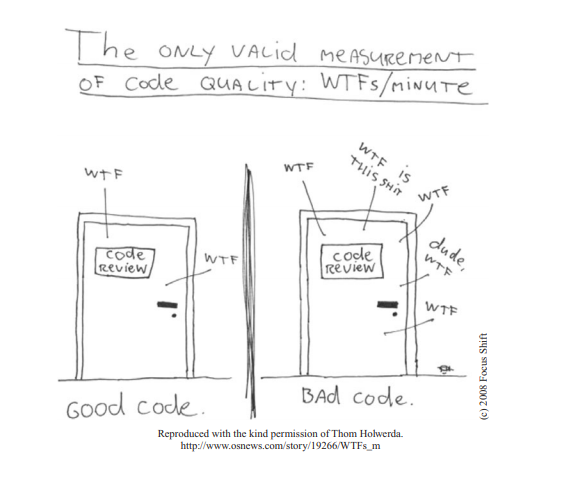
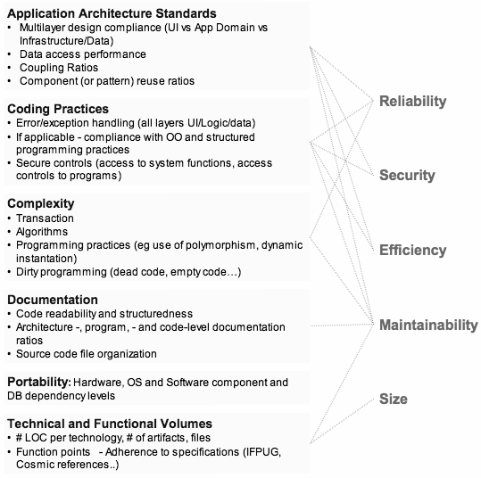
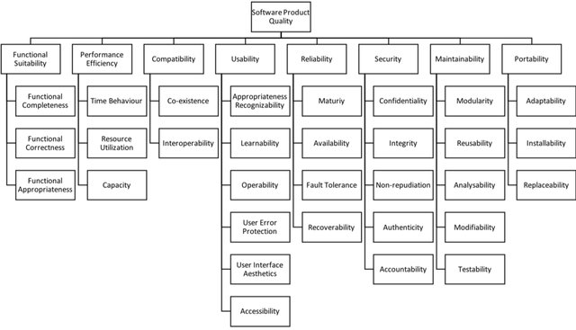

# Software Quality

Overview of section contents:

| Section          | Description                                                  |
| ---------------- | ------------------------------------------------------------ |
| Reliability      | How NSDF builds reliable code                                |
| Efficiency       | How NSDF builds efficient code                               |
| Security         | The practices that NSDF takes to ensure secured code         |
| Maintainability  | The practices that NSDF takes for code maintenance           |
| Rate of Delivery | NSDF adopts the agile software development approach          |
| Automatic tools  | NSDF utilizes the CI/CD pipeline tool for checking software quality |

---

Software Quality is a very complex and broad argument, and it’s out of the scope for this document to cover it in detail.

There are several methods for evaluating software quality, and choosing the right one is a difficult task as well since it depends on the software product, the project objectives, and the context of use.

Experts agree that _high-quality code_ uses coding conventions, is readable and well documented, is reusable and avoids duplication, handles errors diligently, is efficiently using resources, includes unit tests, and complies with security best practices.

In the following sections, we use the Software Quality definition given by the _Consortium for Information & Software Quality_ (CISQ), a group that develops standards for automating the measurement of software size and structural quality.

CISQ: how to build quality code. The relationship between “measurable attributes“ (left) and “software desirable characteristics“ (right). Source: https://en.wikipedia.org/wiki/Software_quality

A more structured view of “Software Product Quality” as described from the international standard ISO 25010.

## Reliability

Reliability refers to the level of risk inherent in software, and the likelihood it will fail.  

Reliability also addresses *stability*, defined as how likely there will be *software regressions* (i.e. bugs where a feature that has worked before stops working) if changes are made. 

A synonym is “resilience“ defined as the software’s ability to deal with failures; for example, modern *microservices-based applications* can be automatically redeployed in case of crashes, making this type of architecture highly resilient.

Metrics to measure reliability are:

| Name                       | Description                                                  |
| -------------------------- | ------------------------------------------------------------ |
| Production incidents       | are the number of high-priority bugs identified in production. |
| Reliability testing        | for example _load testing_, which checks how the software functions under high loads; or _regression testing_, which checks how many defects are introduced when software is deployed. The aggregate results of all these tests are a measure of resiliency. |
| Reliability evaluation     | is a set of tests that run in a simulated environment. It is also a measure of how the software will work in a steady-state or under certain growth (e.g. more users or higher throughput). |
| The average failure rate   | measures the average number of failures over a certain period. |
| Mean-time between failures | is a metric used to measure \_uptime, \_defined as the time software is expected to work correctly until the next failure. |

NSDF builds _Reliable Code_ by:

-   being transparent about security beaches. Any incident will imply writing an _Incident Report_ with all the details and countermeasures. Particular emphasis should be dedicated to the “_What could have been handled better?_” section, to improve the overall process and improve the reliability.
-   Add automatic testing in all SDLC phases. See the “_Continuous Testing_” paragraph for more details.
-   Add a _staging/pre-production environment \_to be used for installing, configuring, migrating code before going to production. See the _“Kubernetes”\_ paragraph.
-   Add monitoring and event logging to keep track of uptimes and failures. See the “_Continuous Monitoring_” paragraph for more details.

Some services can benefit from making use of “Chaos Engineering” such as automated by ChaosMonkey ([https://netflix.github.io/chaosmonkey/](https://netflix.github.io/chaosmonkey/)) which randomly kills service instances so developers automate recovery procedures.

## Efficiency

The most important elements that contribute to an application’s performance are related to how source code is well (or poorly) written; its internal structure; what components are running (e.g.databases, web servers, load balancers, caching nodes), and how they integrate/communicate, etc.

Scalability is also a key aspect to evaluate performance: systems that can _horizontally scale up and down_, automatically adapting to different levels of required performance.

To measure the efficiency we use:

| Name                               | Description                                                  |
| ---------------------------------- | ------------------------------------------------------------ |
| Load testing                       | is conducted to understand the behavior of the system under certain loads. |
| Stress testing                     | to understand the upper limit of the capacity of the system. |
| Soak testing                       | to check if the system can handle a sustained load for a prolonged period, and if/when performance will start to degrade. |
| Application performance monitoring | is a category of software tools that provide metrics and insights specifically for performance. |

NSDF will build _Efficient Code_ by:

-   Adding automatic tests to all the SDLC to create a history of measures_(e.g._ code performance, network flows, storage IOPS, transactions per second, etc). See the “_Continuous Testing_” paragraph for more details.
-   Adding Monitoring and Event Logging to the software stack, to detect performance issues as early as possible. See the “_Continuous Monitoring” paragraph \_for more details_.\_
-   Adding elastic computing with Kubernetes deployments and health checks for moving loads away from faulty nodes. See the “_Kubernetes_” paragraph for more details.

## Security

Security reflects how likely attackers might breach the software, interrupt its activity, or gain access to sensitive information, due to poor coding practices.

Software security can be measured as

| Name                           | Description                                                  |
| ------------------------------ | ------------------------------------------------------------ |
| The number of vulnerabilities  | found by scanners.                                           |
| Time to resolve problems       | how long has it’s taken from the discovery of a vulnerability until the fix |
| Deployment of security updates | how often patches and security updates are deployed          |
| Security incidents             | defined as the severity, number, and total time of attacks.  |

NSDF develops secure code by:

-   Following best practices as described in the “_Software Security_” paragraph
-   Add automatic vulnerability scanners to the CI/CD pipeline
-   Share security incidents knowledge in “Incident reports”
-   Collaborate closely with security experts.

## Maintainability

Software Maintainability is the ease with which software can be adapted to other purposes, how portable it is between environments, and whether it is *transferable* from one team to another.

Maintainability is closely related to code quality. If the code is of high quality, the software is likely to be more easily maintainable: it will take less time and cost to adapt it to changing requirements. The maintainable software is also more likely to have improved reliability, performance, and security.

We measure maintainability by:

| Measure                     | Description                                                  |
| --------------------------- | ------------------------------------------------------------ |
| Lines of code               | Software with more lines of code tends to be more difficult to maintain and more prone to code quality issues. |
| Static code analysis        | is an automatic examination of code to identify problems and ensure the code adheres to industry standards. |
| Software complexity metrics | we measure code complexity using widely-adopted algorithms (e.g. _cyclomatic complexity_ and _N-node complexity)_. |

NSDF develops _Maintainable Code_ by:

-   Using code reviews to share the knowledge and promote good code. See the “_Continuous Integration_” paragraph for more details.
-   Adding automatic static code analysis and software metrics to the CI/CD pipeline. See the “_Continuous Integration_” paragraph for more details.
-   Adding code coverage and automatic testing. See the “_Continuous Testing_” paragraph for more details.
-   Adopting an efficient online documental system to better explain the software to both internal developers and external stakeholders. See the “_Continuous Documentation_” paragraph for more details.

## Rate of Delivery

The rate of software delivery is related to quality because a new version of a software system will typically contain improvements. A higher frequency of releases should mean, at least in theory, that the user gets better software faster.

In agile development, new iterations of software are very quick:  in Continuous Delivery/ Deployment software is usually shipped every day, or even several times a day.

To measure the rate of software delivery, we use:

| Measure                         | Description                                                  |
| ------------------------------- | ------------------------------------------------------------ |
| The number of software releases | i.e. how frequently new software is produced.                |
| Agile stories number            | of “user requirements“ shipped over a certain period         |
| User consumption                | of releases measures the number of downloads/installation of patches or software updates. |

NSDF speeds up the rate of delivery by:

-   adopting best practices of the Agile (Programming) philosophy.

## Automatic Tools

NSDF suggests introducing in the CI/CD pipeline an online tool for checking software quality (see [Comparison of Automated Code Review Tools: Codebeat, Codacy, Codeclimate, and Scrutinizer](https://www.netguru.com/blog/comparison-automated-code-review-tools-codebeat-codacy-codeclimate-scrutinizer#:~:text=CodeClimate%20is%20a%20well%2Ddeveloped,it%20as%20the%20best%20option)).

The prices of the solutions presented in the below table should be double-checked to be viable for the NSDF pilot:

- [SonarQube](https://www.sonarqube.org/) is an open-source platform developed by SonarSource for continuous inspection of code quality to perform automatic reviews with static analysis of code to detect bugs, code smells, and security vulnerabilities on 20+ programming languages. SonarQube offers reports on duplicated code, coding standards, unit tests, code coverage, code complexity, comments, bugs, and security vulnerabilities. SonarQube is meant to be integrated on-premise, while SonarCloud is meant to be integrated with cloud solutions.
- [Codacy](http://www.codacy.com/) automates code reviews and monitors code quality on every commit and pull request reporting back the impact of every commit or pull request, issues concerning code style, best practices, security, and many others. It monitors changes in code coverage, code duplication, and code complexity. Saving developers time in code reviews thus efficiently tackling technical debt. JavaScript, Java, Ruby, Scala, PHP, Python, CoffeeScript, and CSS are currently supported. Codacy is static analysis without the hassle.
- [Code Climate](https://codeclimate.com/) is a well-developed and very stable solution with a great number of features. It supports a great number of programming languages, it is used by big players (e.g. New Relic, jQuery), and has a well-maintained test coverage
- [Codecov ](https://about.codecov.io/)Can show code coverages for many languages including Java, Python, and Javascript. Shows unified coverage and separate coverage for matrix builds.

## Links/Bibliography

List:

- [State of the Industry Report on Software Quality Analysis](https://drive.google.com/file/d/1Ld28gUJ8xP1mquMRsyuxfZTj4cFPiF_N/view?usp=sharing)
- [The Cost of Poor Software Quality in the US: A 2020 Report](https://drive.google.com/file/d/1dA0sTG4BF0u4hWqhL44j5y6QzqYr_93M/view?usp=sharing)
- [A Comprehensive Guide to Measuring Software Quality](https://www.sealights.io/software-quality/measuring-software-quality-a-practical-guide/)
- [Software quality - Wikipedia](https://en.wikipedia.org/wiki/Software_quality)
- [Defining and Measuring Software Sustainability: Towards an Empirical Framework for Evaluation at the Architectural Level](https://www.research.manchester.ac.uk/portal/files/24263271/POST-PEER-REVIEW-PUBLISHERS.PDF)
- [Software Quality Standards](https://pdfs.semanticscholar.org/6295/4ad28f9dfa093fdb7774f6f9e365043c83b7.pdf?_ga=2.98977054.1480268185.1642412225-786165106.1641745451)
- [Google's SRE book-Incident Response](https://sre.google/workbook/incident-response/)
- [Comparison of Automated Code Review Tools: Codebeat, Codacy, Codeclimate, and Scrutinizer](https://www.netguru.com/blog/comparison-automated-code-review-tools-codebeat-codacy-codeclimate-scrutinizer#:~:text=CodeClimate%20is%20a%20well%2Ddeveloped,it%20as%20the%20best%20option).
