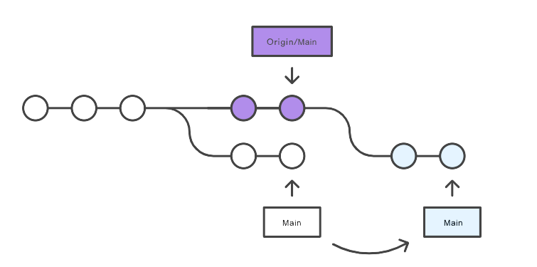
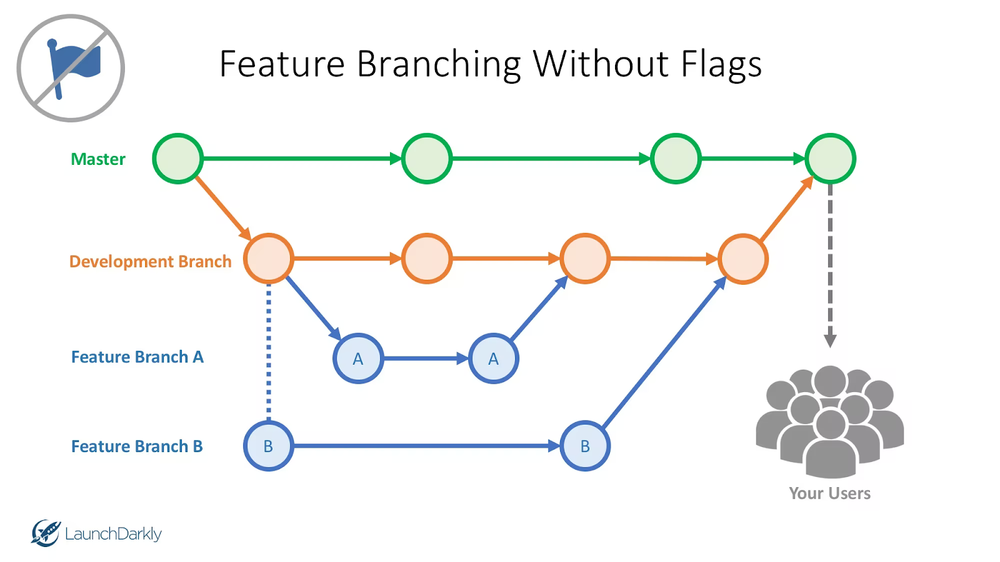
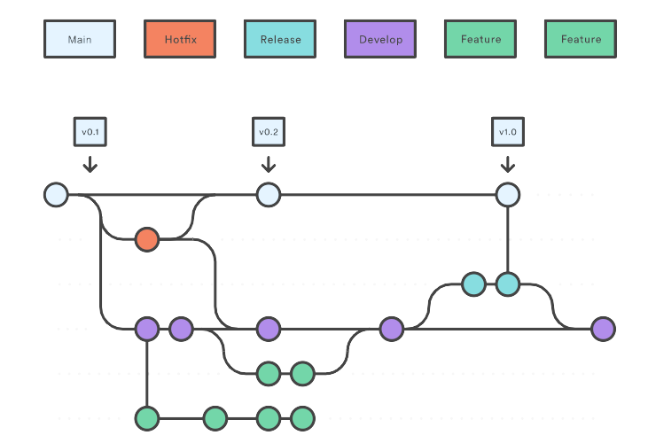
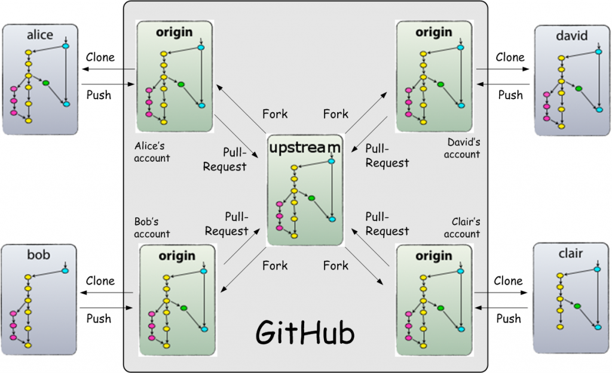

# Appendix I. Git Workflows

## Centralized Workflow

The _Centralized Workflow_ uses a central repository to serve as the single point-of-entry for all changes to the project. The default development branch is called main and all changes are committed into this branch.

This workflow doesn’t require any other branches besides main.

Figure. Example of centralized workflow

In the figure above, we show a typical example of a centralized workflow:

-   the user “**purple**” develops, commits, and pushes changes to the central repository (Origin/Main).
-   Meanwhile, user “**white**” is developing and committing locally. His changes are temporarily \_on-hold \_since he is in bug-fixing mode.
-   When user **‘white’ **tries to push its changes remotely, he receives an error because he is out-_of-sync \_with the central repo_.\_
-   He does a `git pull --rebase`, to merge the new changes; he eventually resolves conflicts, and he pushes the new changes to the origin

In the end, this workflow works as there was just one development continuous line.

## Feature Branching Workflow

_Feature Branching_ (also known as _Task Branching_) is a logical extension of Centralized Workflow.

The idea behind “Feature Branches” is that all feature development should take place in a dedicated branch instead of the main branch. This encapsulation makes it easier for multiple developers to work on a particular task without disturbing the central codebase.

These branches are often referred to as_ user stories_.

The main branch should never contain broken code, which is a huge advantage for continuous integration environments.

Feature Branching also helps developers \_easily segment \_their work: instead of tackling an entire release, they can focus on a small set of changes.

Feature branches can also be divided up according to specific _feature groups_. Each team or sub-team could maintain its branch for development. once finished, changes can be tested and reviewed before the final integration.

Example of feature branching

## Gitflow Workflow

The Gitflow Workflow \was first published in a highly regarded 2010 blog post from [Vincent Driessen at nvie](http://nvie.com/posts/a-successful-git-branching-model/). This workflow doesn’t add any new concepts or commands beyond what’s required for the \Feature Branch Workflow.  Instead, it assigns very specific roles to different branches and defines how and when they should interact.

Gitflow consists of two branches, main (formerly named master) and develop:

-   the _main branch_ is for production-ready code
-   the _develop branch_ is for work-in-progress code

In preparation for new releases, the development branch is tested until it is declared stable and merged into the main branch.

*New features* are checked out from the `develop` branch; developed on relative branches; and merged back into develop after code reviews.

_New releases_ are created by checking out the develop branch to *a new release branch for major releases or* merged into an existing release branch for minor releases.

_Hotfix branches_ are created for urgent fixes. They are checked out from the main branch and merged into both the `main`  and `develop` branches.

Figure Example of Gitflow workflow
 

## Forking Workflow

Instead of using a single server-side repository to act as the “central” codebase, *Forking Workflow* requests every developer to have their server-side repository.

This means that each contributor has not one, but two Git repositories: a private local one and a public server-side one.

The _Forking Workflow_ is most common in public open-source projects since contributions can be integrated without the need for everybody to push to a single central repository: developers push to their server-side repositories, and only the _project maintainer_ has the rights to push to the official repository. This allows the \_project maintainer \_to accept commits without granting write-access.

 Example of forking workflow. Source https://www.dalescott.net/using-gitflow-with-githubs-fork-pull-model/
 

## GitHub Flow

GitHub flow simplifies the use of Gitflow: the main branch contains the production-ready code and new features are developed using \_feature branches that are merged into the main branch after a (1) pull request, (2) code review (3) integration tests.

GitHub flow doesn't use develop, release, or hotfix branches.

> *GitHub Flow has some of the same elements as Git Flow, such as feature branches. But unlike Git Flow, GitHub Flow combines the mainline and release branches into a “master” and treats hotfixes just like feature branches. ([https://www.freshconsulting.com/insights/blog/git-development-workflows-git-flow-vs-github-flow/](https://www.freshconsulting.com/insights/blog/git-development-workflows-git-flow-vs-github-flow/) )*

_GitHub Flow_ provides almost all the functionality that _Git Flow_, but is scaled back for a more adaptable workflow with slightly less overhead.

